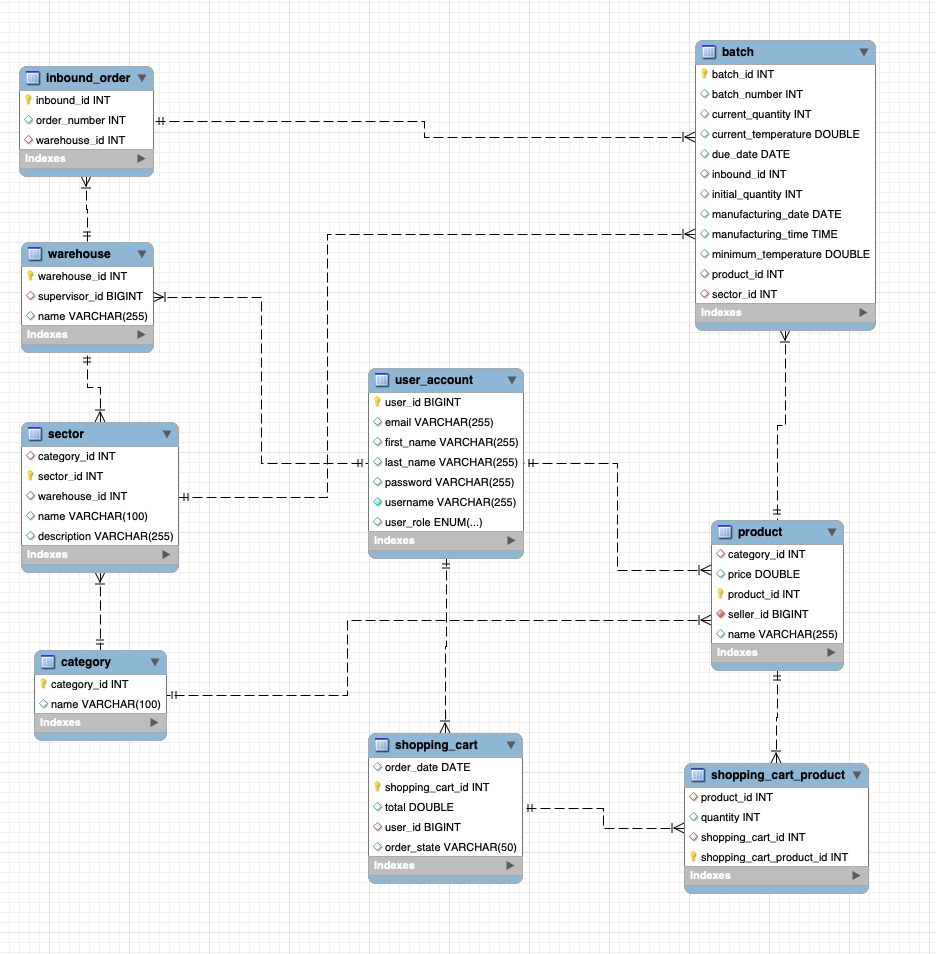

# pf-be-hisp-w26-t10-gonzalez
Este proyecto forma parte del Java Bootcamp W26 y consiste en el desarrollo de una API en Java para gestionar productos dentro de los almacenes de Mercado Libre. Los productos pueden pertenecer a diferentes categorías como frescos, congelados y refrigerados.

- Características Principales:
Gestión de Productos: Permite a los usuarios, según su rol, realizar operaciones como ingresar lotes de productos, insertar nuevos productos, actualizar productos existentes y realizar compras.

- Seguridad y Roles: 
Implementa medidas de seguridad para asegurar que solo los usuarios autorizados puedan realizar operaciones específicas, como la inserción y actualización de productos.

- Funcionalidades Clave:
Ingreso de Lotes de Productos: Facilita la carga masiva de productos en los almacenes, asegurando un registro preciso y eficiente de las existencias.

- Gestión de Inventario:
Permite a los usuarios consultar la disponibilidad de productos por categoría y realizar actualizaciones según las necesidades del negocio.

- Compras y Ventas: 
Provee funcionalidades para que los usuarios puedan comprar productos disponibles en los almacenes, garantizando una experiencia fluida de compra.

# Tecnologias
- Spring Framework
- Hibernate
- JPA
- MySQL

- Test
  - Jacoco
  - Mockito
  - Mock MVC

- Fury
  - MySQL
  - Scope Web

# pf-be-hisp-w26-t10-gonzalez
Este proyecto forma parte del Java Bootcamp W26 y consiste en el desarrollo de una API en Java para gestionar productos dentro de los almacenes de Mercado Libre. Los productos pueden pertenecer a diferentes categorías como frescos, congelados y refrigerados.

- Características Principales:
  Gestión de Productos: Permite a los usuarios, según su rol, realizar operaciones como ingresar lotes de productos, insertar nuevos productos, actualizar productos existentes y realizar compras.

- Seguridad y Roles:
  Implementa medidas de seguridad para asegurar que solo los usuarios autorizados puedan realizar operaciones específicas, como la inserción y actualización de productos.

- Funcionalidades Clave:
  Ingreso de Lotes de Productos: Facilita la carga masiva de productos en los almacenes, asegurando un registro preciso y eficiente de las existencias.

- Gestión de Inventario:
  Permite a los usuarios consultar la disponibilidad de productos por categoría y realizar actualizaciones según las necesidades del negocio.

- Compras y Ventas:
  Provee funcionalidades para que los usuarios puedan comprar productos disponibles en los almacenes, garantizando una experiencia fluida de compra.

# Tecnologias
- Spring Framework
- Hibernate
- JPA
- MySQL

- Test
  - Jacoco
  - Mockito
  - Mock MVC

- Fury
  - MySQL
  - Scope Web
  -
# Diagrama de DB


# Variables de entorno
```yaml
  DB_LOCAL_USER=usuario de mysql 
  DB_LOCAL_PASS=pass de mysql 
  DB_LOCAL_NAME=nombre de la base de datos dentro de mysql
  DB_LOCAL_PORT=puerto de mysq
```


# Variables de entorno
```yaml
  DB_LOCAL_USER=usuario de mysql 
  DB_LOCAL_PASS=pass de mysql 
  DB_LOCAL_NAME=nombre de la base de datos dentro de mysql
  DB_LOCAL_PORT=puerto de mysq
```


