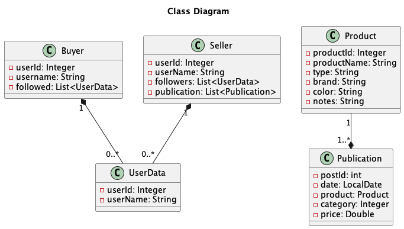

# Grupo 03 - SocialMeli
# Sprint I

En este proyecto desarrollaremos una API para la nueva herramienta de Mercado Libre, __SocialMeli__.

## Integrantes

- Blas Bulacio
- Camila Beczkowski
- Andrés García
- Andrés Kubler
- Bruno Donato
- Leonel Abatte

## Tabla de contenidos

- [Entidades](#entidades)
    - [UserData](#1-userdata)
    - [Seller](#2-seller)
    - [Buyer](#3-buyer)
    - [Publication](#4-publication)
    - [Product](#5-product)
- [Diagrama de clases](#diagrama-de-clases)
- [Endpoints](#endpoints)
  - [Seguir a un usuario](#1-seguir-a-un-usuario)
  - [Cantidad de usuarios que siguen a un vendedor](#2-obtener-el-resultado-de-la-cantidad-de-usuarios-que-siguen-a-un-determinado-vendedor)
  - [Usuarios que siguen a un vendedor](#3-obtener-el-listado-de-todos-los-usuarios-que-siguen-a-un-determinado-vendedor)
  - [Vendedores a los cuales sigue un usuario](#4-obtener-un-listado-de-todos-los-vendedores-a-los-cuales-sigue-un-determinado-usuario)
  - [Dar de alta una publicación](#5-dar-de-alta-una-publicación)
  - [Publicaciones de un vendedor que un usuario sigue en las últimas dos semanas](#6-6-obtener-un-listado-de-las-publicaciones-realizadas-por-los-vendedores-que-un-usuario-sigue-en-las-últimas-dos-semanas)
  - [Poder realizar la acción de “Unfollow”](#7-poder-realizar-la-acción-de-unfollow)

## Entidades

### 1. UserData

Es la información de un usuario registrado en __SocialMeli__.

#### Atributos

| Campo | Tipo | Descripción                                           |
|-------|------|-------------------------------------------------------|
| user_id | Integer | Identificador del usuario                             |
| user_name | String | Nombre del usuario                                    |

### 2. Seller

Es el usuario que puede subir publicaciones y ser seguido por compradores.

#### Atributos

| Campo | Tipo | Descripción                                           |
|-------|------|-------------------------------------------------------|
| user_id | Integer | Identificador del usuario                             |
| user_name | String | Nombre del usuario                                    |
| followers | List<UserData> | Lista de la información de los seguidores del usuario |
| publications | List<Publication> | Lista de publicaciones del usuario                    |

### 3. Buyer

Es el usuario que sigue a los vendedores.

#### Atributos


| Campo | Tipo | Descripción                                                     |
|-------|------|-----------------------------------------------------------------|
| user_id | Integer | Identificador del usuario                                       |
| user_name | String | Nombre del usuario                                              |
| followed | List<UserData> | Lista de la información de los usuarios seguidos por el usuario |


### 4. Publication

Es la publicación de un producto que realiza un vendedor.

#### Atributos


| Campo | Tipo | Descripción                                                     |
|-------|------|-----------------------------------------------------------------|
| post_id | Integer | Identificador de la publicación                                |
| user_id | Integer | Identificador del usuario que realizó la publicación           |
| date | LocalDate | Fecha de la publicación                                        |
| product | Product | Producto que se está vendiendo                                 |
| category | Integer | Identificador de la categoría del producto                     |
| price | Double | Precio del producto                                             |

### 5. Product

El producto que se está vendiendo.

#### Atributos

| Campo | Tipo | Descripción                                                     |
|-------|------|-----------------------------------------------------------------|
| product_id | Integer | Identificador del producto                                     |
| product_name | String | Nombre del producto                                             |
| brand | String | Marca del producto                                              |
| color | String | Color del producto                                              |
| notes | String | Notas adicionales sobre el producto                             |

## Diagrama de clases



## Endpoints

### 1. Seguir a un usuario


```http
POST /users/{userId}/follow/{userIdToFollow}
```

#### Filtros/Parámetros:

| Parámetro | Tipo | Descripción                                       |
|-------|------|---------------------------------------------------|
| userId | Integer | Número que identifica a un usario de tipo `Buyer` |
| userIdToFollow | Integer | Número que identifica a un usario de tipo `Seller`  |


### 2. Obtener el resultado de la cantidad de usuarios que siguen a un determinado vendedor

```http
GET /users/{userId}/followers/count
```
#### Response
```http
{
    "user_id": 234,
    "user_name": "vendedor1",
    "followers_count": 35
}
```

#### Filtros/Parámetros:

| Parámetro | Tipo | Descripción |
|-------|------|----------------------------------------------------------------|
| userId | Integer | Número que identifica a un usario de tipo `Seller` |

### 3. Obtener el listado de todos los usuarios que siguen a un determinado vendedor

```http
GET /users/{userId}/followers/list
GET /users/{userId}/followers/list?order=name_asc
GET /users/{userId}/followers/list?order=name_desc
```

#### Response
```http
{
    "user_id": 234,
    "user_name": "vendedor1",
    "followers": [
        {
            "user_id": 1,
            "user_name": "comprador1"
        },
        {
            "user_id": 2,
            "user_name": "comprador2"
        }
    ]
}
```

#### Filtros/Parámetros:

| Parámetro | Tipo | Descripción |
|-------|------|----------------------------------------------------------------|
| userId | Integer | Número que identifica a un usario de tipo `Seller` |

### 4. Obtener  un listado de todos los vendedores a los cuales sigue un determinado usuario

```http
GET /users/{userId}/followed/list
GET /users/{userId}/followed/list?order=name_asc
GET /users/{userId}/followed/list?order=name_desc
```

#### Response
```http
{
    "user_id": 234,
    "user_name": "comprador1",
    "followed": [
        {
            "user_id": 1,
            "user_name": "vendedor1"
        },
        {
            "user_id": 2,
            "user_name": "vendedor2"
        }
    ]
}
```

#### Filtros/Parámetros:

| Parámetro | Tipo | Descripción                                       |
|-------|------|---------------------------------------------------|
| userId | Integer | Número que identifica a un usario de tipo `Buyer` |

### 5. Dar de alta una publicación

```http
POST /products/newpost
```

#### Payload

| Parámetro | Tipo | Descripción                                                                      |
|-------|------|----------------------------------------------------------------------------------|
| userId | Integer | Número que identifica a un usario de tipo `Seller`                               |
| date | LocalDate | Fecha de la publicación en formato dd-MM-yyyy                                    |
| detail | Product | Detalle del producto                                                             |
| category | Integer | Identificador que sirve para conocer la categoría a la que pertenece un producto |
| price | Double | Precio del producto                                                              |

Ejemplo:

```http
{
    "userId": 1,
    "date": "2023-03-01",
    "detail": {
        "product_id": 1,
        "productName": "Producto 1",
        "brand": "Marca 1",
        "color": "Color 1",
        "notes": "Notas 1"
    },
    "category": 1,
    "price": 100.0
}
```

### 6. 6: Obtener un listado de las publicaciones realizadas por los vendedores que un usuario sigue en las últimas dos semanas

```http
GET /products/followed/{userId}/list
GET /products/followed/{userId}/list?order=date_asc
GET /products/followed/{userId}/list?order=date_desc
```

#### Response

```http
{
    "userId": 1,
    "posts": [
        {
            "postId": 1,
            "date": "2023-03-01",
            "detail": {
                "productId": 1,
                "productName": "Producto 1",
                "brand": "Marca 1",
                "color": "Color 1",
                "notes": "Notas 1"
            },
            "category": 1,
            "price": 100.0
        },
        {
            "postId": 2,
            "date": "2023-03-02",
            "detail": {
                "productId": 2,
                "productName": "Producto 2",
                "brand": "Marca 2",
                "color": "Color 2",
                "notes": "Notas 2"
            },
            "category": 2,
            "price": 200.0
        }
    ]
}
```

#### Filtros/Parámetros

| Parámetro | Tipo | Descripción |
|-------|------|----------------------------------------------------------------|
| userId | Integer | Número que identifica a un usario de tipo `Buyer` |

### 7. Poder realizar la acción de “Unfollow”

```http
POST /users/{userId}/unfollow/{userIdToUnfollow}
```

#### Filtros/Parámetros:

| Parámetro | Tipo | Descripción                                        |
|-------|------|----------------------------------------------------|
| userId | Integer | Número que identifica a un usario de tipo `Buyer`  |
| userIdToUnfollow | Integer | Número que identifica a un usario de tipo `Seller` |

# Sprint II

En este sprint realizaremos las validaciones y test de la API desarrollada en el anterior sprint de __SocialMeli__.

| Requerimientos | Situaciones de entrada | Comportamiento Esperado | Story points (serie de Fibonacci) |
| --- | --- | --- | --- |
| T-0000 | Validaciones |  | 1 |
| T-0001 | Verificar que el usuario a seguir exista. (US-0001) | Se cumple: Permite continuar con normalidad. No se cumple: Notifica la no existencia mediante una excepción. | 2 |
| T-0002 | Verificar que el usuario a dejar de seguir exista. (US-0007). | Se cumple: Permite continuar con normalidad. No se cumple: Notifica la no existencia mediante una excepción. | 2 |
| T-0003 | Verificar que el tipo de ordenamiento alfabético exista (US-0008) name_asc , name_desc | Se cumple: Permite continuar con normalidad. No se cumple: Notifica la no existencia mediante una excepción. | 2 |
| T-0004 | Verificar el correcto ordenamiento ascendente y descendente por nombre. (US-0008) | Devuelve la lista ordenada según el criterio solicitado | 5 |
| T-0005 | Verificar que el tipo de ordenamiento por fecha exista (US-0009) date_asc , date_desc | Se cumple: Permite continuar con normalidad. No se cumple: Notifica la no existencia mediante una excepción. | 2 |
| T-0006 | Verificar el correcto ordenamiento ascendente y descendente por fecha. (US-0009) | Devuelve la lista ordenada según el criterio solicitado | 3 |
| T-0007 | Verificar que la cantidad de seguidores de un determinado usuario sea correcta. (US-0002) | Devuelve el cálculo correcto del total de la cantidad de seguidores que posee un usuario. | 2 |
| T-0008 | Verificar que la consulta de publicaciones realizadas en las últimas dos semanas de un determinado vendedor sean efectivamente de las últimas dos semanas. (US-0006) | Devuelve únicamente los datos de las publicaciones que tengan fecha de publicación dentro de las últimas dos semanas a partir del día de la fecha. | 3 |

### T-0000 Validaciones

| Dato/Parámetro | ¿Obligatorio? | Validación | Mensaje de error |
| --- | --- | --- | --- |
| user_id | Sí | - Que el campo no esté vacío. - Mayor que 0 | - El id no puede estar vacío. - El id debe ser mayor a cero |
| date | Sí | - Que el campo no esté vacío. | - La fecha no puede estar vacía. |
| product_id | Sí | - Que el campo no esté vacío. - Mayor que 0 | - La id no puede estar vacía. - El id debe ser mayor a cero |
| product_name | Sí | - Que el campo no esté vacío. - Longitud máxima de 40 caracteres. - Que no posea caracteres especiales (%, &, $, etc), permite espacios. | - El campo no puede estar vacío. - La longitud no puede superar los 40 caracteres. - El campo no puede poseer caracteres especiales. |
| type | Sí | - Que el campo no esté vacío. - Longitud máxima de 15 caracteres. - Que no posea caracteres especiales (%, &, $, etc) | - El campo no puede estar vacío. - La longitud no puede superar los 15 caracteres. - El campo no puede poseer caracteres especiales. |
| brand | Sí | - Que el campo no esté vacío. - Longitud máxima de 25 caracteres. - Que no posea caracteres especiales (%, &, $, etc) | - La longitud no puede superar los 25 caracteres. - El campo no puede estar vacío. - El campo no puede poseer caracteres especiales. |
| color | Sí | - Que el campo no esté vacío. - Longitud máxima de 15 caracteres. - Que no posea caracteres especiales (%, &, $, etc) | - El campo no puede estar vacío. - La longitud no puede superar los 15 caracteres. - El campo no puede poseer caracteres especiales. |
| notes | No | - Longitud máxima de 80 caracteres. - Que no posea caracteres especiales (%, &, $, etc), permite espacios. | - La longitud no puede superar los 80 caracteres. - El campo no puede poseer caracteres especiales. |
| category | Sí | - Que el campo no esté vacío. | - El campo no puede estar vacío. |
| price | Sí | - Que el campo no esté vacío. - El precio máximo puede ser 10.000.000. | - El campo no puede estar vacío. - El precio máximo por producto es de 10.000.000 |

