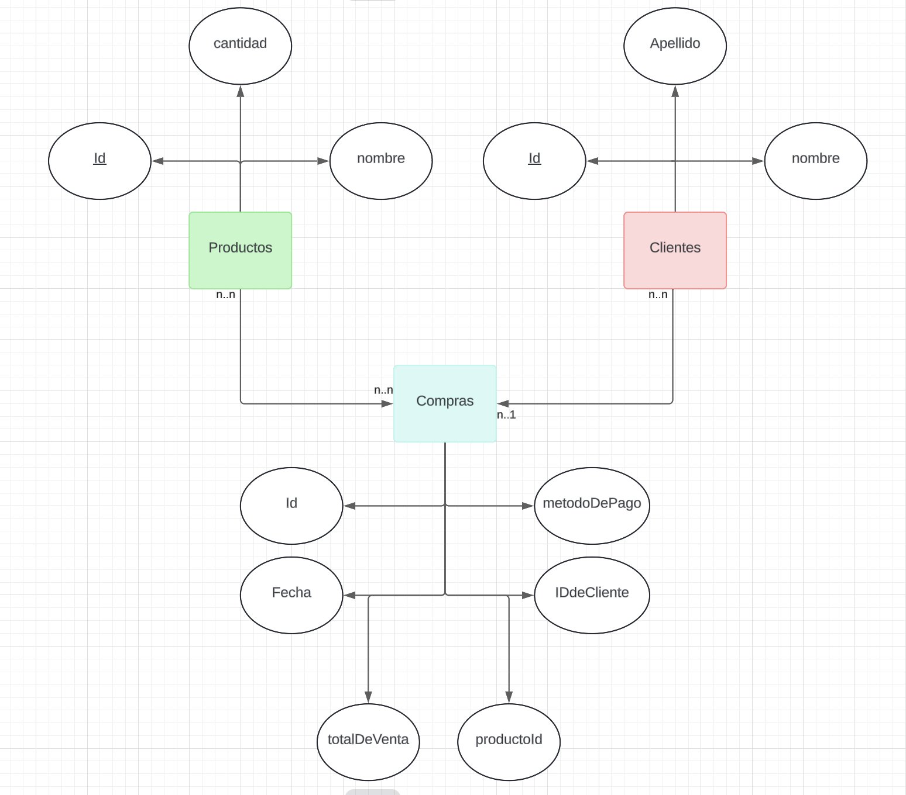
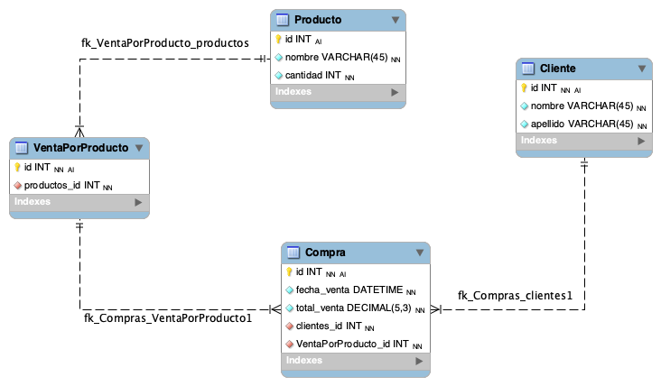

# Planteo Diagrama Entidad Relación

Una mueblería necesita la implementación de una base de datos para controlar las ventas que realiza por día, el stock de sus artículos (productos) y la lista de sus clientes que realizan las compras.

Se necesita plantear:

1. ¿Cuáles serían las entidades de este sistema?
2. ¿Qué atributos se determinarán para cada entidad? (Considerar los que se crean necesarios)
3. ¿Cómo se conformarán las relaciones entre entidades? ¿Cuáles serían las cardinalidades?
4. Realizar un DER para modelar el escenario planteado.

## Solución DER - Diagramas

