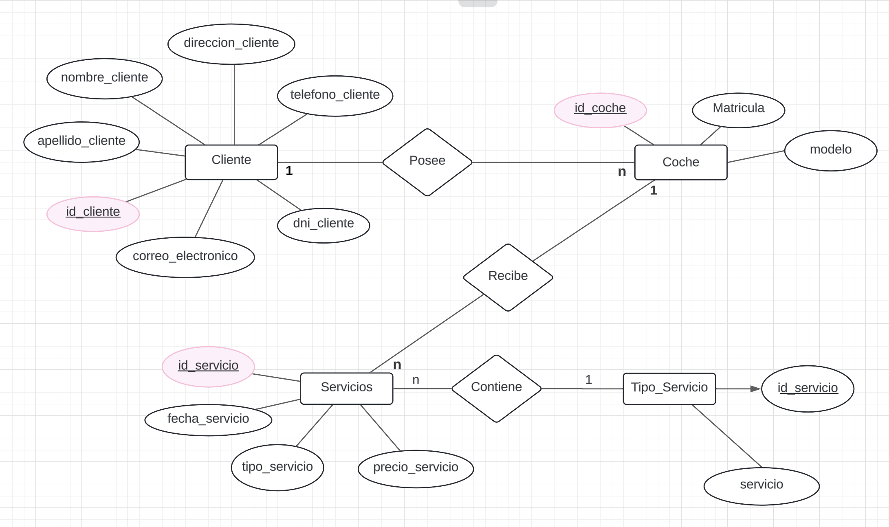
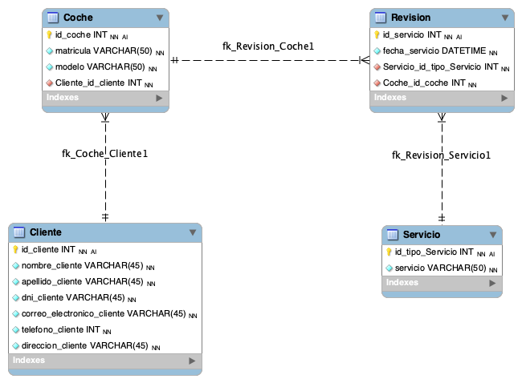

#  Diseño Diagrama Entidad-Relación

Realizar un diagrama de entidad - relación para el sistema de una concesionaria, que desea gestionar los servicios de los coches de sus clientes.

Para el módulo del sistema, se necesita almacenar información de los clientes, los coches que estos poseen y los service/revisiones de cada uno de estos.
Utilizar el formato adecuado para representar las Primary y Foreign Key en el diagrama, además de los tipos de datos de cada atributo.

## Solución DER - Diagramas

