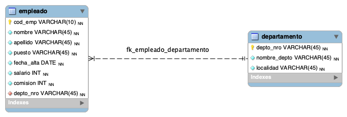

#  Consultas SQL Avanzadas

## Diagrama entidad relación EmpresaDB

## Queries a EmpresaDB

[Ver script de creacion de la DB](script-empresaDB.sql)

Teniendo las tablas de una base de datos de una empresa:

Se requiere obtener las siguientes consultas:

1. Seleccionar el nombre, el puesto y la localidad de los departamentos donde trabajan los vendedores.
2. Visualizar los departamentos con más de cinco empleados.
3. Mostrar el nombre, salario y nombre del departamento de los empleados que tengan el mismo puesto que ‘Mito Barchuk’.
4. Mostrar los datos de los empleados que trabajan en el departamento de contabilidad, ordenados por nombre.
5. Mostrar el nombre del empleado que tiene el salario más bajo.
6. Mostrar los datos del empleado que tiene el salario más alto en el departamento de ‘Ventas’.

[Ver queries a EmpresaDB](queries-empresa.sql)