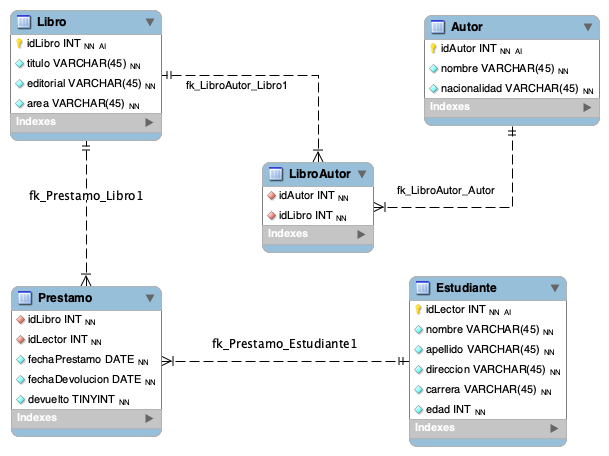

# Consultas SQL Avanzadas

## Ejercicio 1

Se tiene el siguiente DER que corresponde al esquema que presenta la base de datos de una “biblioteca”.

En base al mismo, plantear las consultas SQL para resolver los siguientes requerimientos:

1. Listar los datos de los autores.
2. Listar nombre y edad de los estudiantes
3. ¿Qué estudiantes pertenecen a la carrera informática?
4. ¿Qué autores son de nacionalidad francesa o italiana?
5. ¿Qué libros no son del área de internet?
6. Listar los libros de la editorial Salamandra.
7. Listar los datos de los estudiantes cuya edad es mayor al promedio.
8. Listar los nombres de los estudiantes cuyo apellido comience con la letra G.
9. Listar los autores del libro “El Universo: Guía de viaje”. (Se debe listar solamente los nombres).
10. ¿Qué libros se prestaron al lector “Filippo Galli”?
11. Listar el nombre del estudiante de menor edad.
12. Listar nombres de los estudiantes a los que se prestaron libros de Base de Datos.
13. Listar los libros que pertenecen a la autora J.K. Rowling.
14. Listar títulos de los libros que debían devolverse el 16/07/2021.

[Ver script de creacion de BibliotecaDB](script-bibliotecaDB.sql)

## Ejercicio 2

Implementar la base de datos en PHPMyAdmin o MySQL Workbench, cargar cinco registros en cada tabla y probar algunas consultas planteadas en el Ejercicio

[Ver queries y carga de datos a BibliotecaDB](queries-bibliotecaDB.sql)