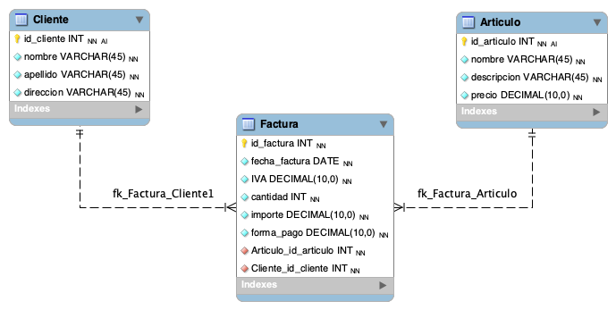

# Normalización

## Escenario

Luego de un análisis realizado en un sistema de facturación, se ha detectado un mal diseño en la base de datos. La misma, cuenta con una tabla facturas que almacena datos de diferente naturaleza.

Como se puede observar, la tabla cuenta con datos que podrían ser normalizados y separados en diferentes entidades.

## Ejercicio

Se solicita para el escenario anterior:

1. Aplicar reglas de normalización y elaborar un modelo de DER que alcance la tercera forma normal (3FN).

2. Describir con sus palabras cada paso de la descomposición y aplicación de las reglas para visualizar el planteo realizado.

- **Identificar las dependencias funcionales:** En este paso, analizamos cómo los atributos de la tabla están relacionados entre sí. Identificamos qué atributos determinan otros y qué combinaciones de atributos determinan los valores de otros atributos.
- **Eliminar dependencias parciales:** Después de identificar las dependencias funcionales, buscamos dependencias parciales, es decir, atributos que dependen solo de una parte de la clave primaria.
- **Eliminar dependencias transitivas:** Una vez que hemos descompuesto la tabla para eliminar dependencias parciales, revisamos si hay dependencias transitivas, es decir, atributos que dependen de otros atributos que no son claves primarias.
- **Crear relaciones entre las tablas descompuestas:** Finalmente, creamos relaciones entre las tablas descompuestas utilizando claves foráneas para mantener la integridad referencial.
