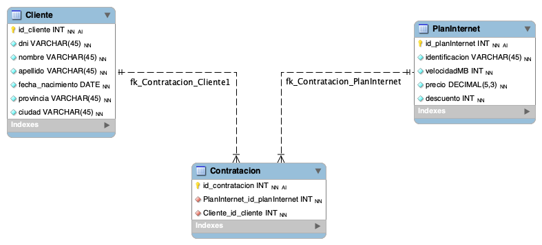

# Bases de datos relacionales - DER y SQL
## Escenario

Una empresa proveedora de Internet necesita una base de datos para almacenar cada uno de sus clientes junto con el plan/pack que tiene contratado.

Mediante un análisis previo se conoce que se tiene que almacenar la siguiente información:

De los clientes se debe registrar: dni, nombre, apellido, fecha de nacimiento, provincia, ciudad.
En cuanto a los planes de internet: identificación del plan, velocidad ofrecida en megas, precio, descuento.

### Ejercicio 1

Luego del planteo de los requerimientos de la empresa, se solicita modelar los mismos mediante un DER (Diagrama Entidad-Relación).

### Ejercicio 2

Una vez modelada y planteada la base de datos, responder a las siguientes preguntas:

a. ¿Cuál es la primary key para la tabla de clientes? Justificar respuesta
- R/. ID del cliente, ya que es el identificador unico de cada cliente

b. ¿Cuál es la primary key para la tabla de planes de internet? Justificar respuesta.
- R/. ID del plan de internet, ya que es el identificador unido de cada plan de internet

c. ¿Cómo serían las relaciones entre tablas? ¿En qué tabla debería haber foreign key? ¿A qué campo de qué tabla hace referencia dicha foreign key? Justificar respuesta.
- R/. Relacion entre las dos tablas a través de una tabla intermedia Contratacion, las foreign keys son los IDs de la tabla Cliente y los IDs de la tabla Plan de internet

### Ejercicio 3

Una vez realizado el planteo del diagrama y de haber respondido estas preguntas, utilizar PHPMyAdmin o MySQL Workbench para ejecutar lo siguiente:

a. Se solicita crear una nueva base de datos llamada “empresa_internet”.

b. Incorporar 10 registros en la tabla de clientes y 5 en la tabla de planes de internet.

c. Realizar las asociaciones/relaciones correspondientes entre estos registros.

[Ver script de creacion de tablas para DB empresa_internet](empresa_internet.sql)

### Ejercicio 4

Plantear 10 consultas SQL que se podrían realizar a la base de datos. Expresar las sentencias.

[Ver script de consultas a la DB empresa_internet](queries.sql)