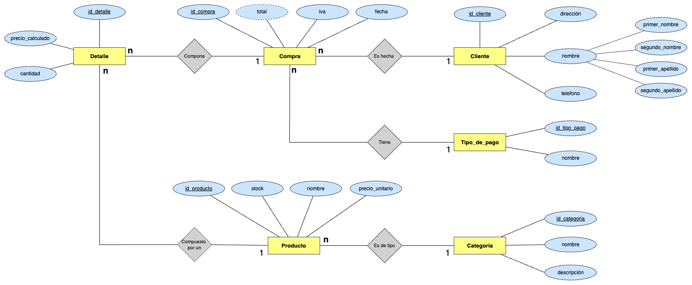

# Ejercicio 1 - Planeto DER

Una mueblería necesita la implementación de una base de datos para controlar las ventas que realiza por día, el stock de sus artículos (productos) y la lista de sus clientes que realizan las compras.

Se necesita plantear:

* ¿Cuáles serían las entidades de este sistema?
* ¿Qué atributos se determinarán para cada entidad? (Considerar los que se crean necesarios)
* ¿Cómo se conformarán las relaciones entre entidades? ¿Cuáles serían las cardinalidades?
* Realizar un DER para modelar el escenario planteado.

## Entidades

* Producto
* Compra
* Cliente
* Detalle
* Categoría
* Tipo_de_pago

## Atributos

* Producto
  * id_producto
  * stock
  * nombre
  * precio_unitario
* Compra
  * id_compra
  * total
  * iva
  * fecha  
* Cliente
  * id_cliente
  * dirección
  * nombre
    * primer_nombre
    * segundo_nombre
    * primer_apellido
    * segundo_apellido 
* Detalle
  * id_detalle
  * precio_calculado
  * cantidad
* Categoría
  * id_categoria
  * nombre
  * descripción
* Tipo_de_pago
  * id_tipo_pago
  * nombre

## Relaciones

* Cada **Compra** es hecha por un **Cliente** --> **n - 1**
* Cada **Detalle** está compuesto de un **Producto** --> **n - 1**
* Cada **Detalle** compone una **Compra** --> **n - 1**
* Cada **Producto** es de tipo **Categoría** --> **n - 1**
* Cada **Compra** Tiene un **Tipo_de_pago** --> **n - 1**

## Diagrama Entidad - Relación

