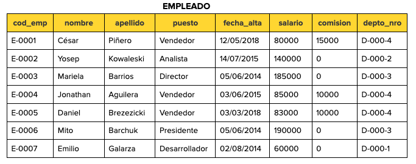
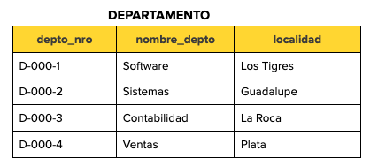
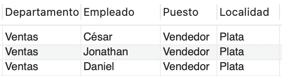
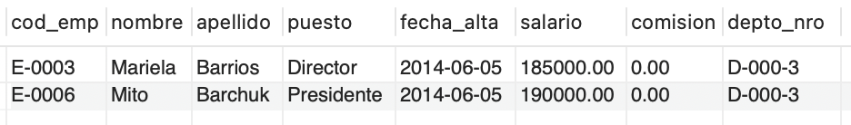
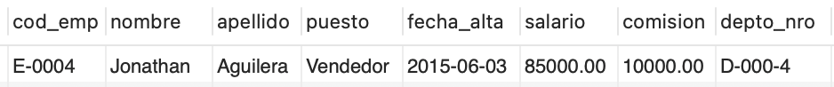

# Ejercicio 6 - Empleados y Departamentos - Consultas SQL Avanzadas

Teniendo las tablas de una base de datos de una empresa:





[Script Base de datos](script.sql)

## Se requiere obtener las siguientes consultas:

### Seleccionar el nombre, el puesto y la localidad de los departamentos donde trabajan los vendedores.

```sql
SELECT de.nombre_depto AS "Departamento", em.nombre AS "Empleado", em.puesto AS "Puesto", de.localidad AS "Localidad"
FROM departamento de INNER JOIN empleado em ON de.depto_nro = em.depto_nro
WHERE de.nombre_depto LIKE 'Ventas';
```

Resultado:



### Visualizar los departamentos con más de cinco empleados.

```sql
SELECT de.nombre_depto AS "Departamento"
FROM departamento de INNER JOIN empleado em ON de.depto_nro = em.depto_nro
GROUP BY de.nombre_depto
HAVING COUNT(em.cod_emp) > 5;
```

Resultado:


### Mostrar el nombre, salario y nombre del departamento de los empleados que tengan el mismo puesto que ‘Mito Barchuk’.

```sql
SELECT CONCAT(em.nombre, ' ', em.apellido) AS "Nombre del empleado", em.salario AS "Salario", de.nombre_depto AS "Departamento"
FROM departamento de INNER JOIN empleado em ON de.depto_nro = em.depto_nro, 
    (SELECT puesto FROM empleado WHERE nombre LIKE 'Mito' AND apellido LIKE 'Barchuk') tp1
WHERE em.puesto = tp1.puest;
```

Resultado:


### Mostrar los datos de los empleados que trabajan en el departamento de contabilidad, ordenados por nombre.

```sql
SELECT em.cod_emp, em.nombre, em.apellido, em.puesto, em.fecha_alta, em.salario, em.comision, em.depto_nro
FROM departamento de INNER JOIN empleado em ON de.depto_nro = em.depto_nro
WHERE de.nombre_depto LIKE 'Contabilidad'
ORDER BY em.nombre;
```

Resultado:



### Mostrar el nombre del empleado que tiene el salario más bajo.

```sql
SELECT em.nombre AS "Empleado"
FROM empleado em
WHERE em.salario IN (SELECT MIN(e.salario) AS s FROM empleado e);
```

Resultado:


### Mostrar los datos del empleado que tiene el salario más alto en el departamento de ‘Ventas’.

```sql
SELECT em.cod_emp, em.nombre, em.apellido, em.puesto, em.fecha_alta, em.salario, em.comision, em.depto_nro
FROM empleado em INNER JOIN departamento dept ON dept.depto_nro = em.depto_nro
WHERE em.salario IN (SELECT MAX(e.salario)
		FROM departamento de INNER JOIN empleado e ON de.depto_nro = e.depto_nro
		WHERE de.nombre_depto LIKE 'Ventas')
	AND dept.nombre_depto LIKE 'Ventas';
```

Resultado:


