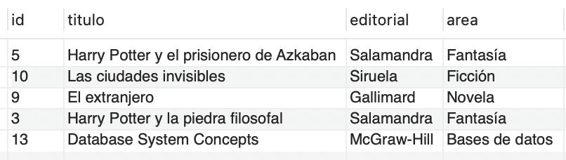

# Ejercicio 6 - Biblioteca

Se tiene el siguiente DER que corresponde al esquema que presenta la base de datos de una “biblioteca”.


[Script de la Base de datos](script.sql)

## En base al mismo, plantear las consultas SQL para resolver los siguientes requerimientos:

### Listar los datos de los autores.

```sql
SELECT aut.id, aut.nombre, aut.nacionalidad
FROM autor aut;
```

Resultado:


### Listar nombre y edad de los estudiantes

```sql
SELECT es.nombre, es.edad
FROM estudiante es;
```

Resultado:


### ¿Qué estudiantes pertenecen a la carrera informática?

```sql
SELECT es.id, es.nombre, es.apellido, es.direccion, es.carrera, es.edad
FROM estudiante es
WHERE es.carrera LIKE "Informática";
```

Resultado:


### ¿Qué autores son de nacionalidad francesa o italiana?

```sql
SELECT aut.id, aut.nombre, aut.nacionalidad
FROM autor aut
WHERE aut.nacionalidad LIKE 'Francesa' OR aut.nacionalidad LIKE 'Italiana';
```

Resultado:


### ¿Qué libros no son del área de internet?

```sql
SELECT li.id, li.titulo, li.editorial, li.area
FROM libro li
WHERE li.area NOT LIKE 'Internet';
```

Resultado:


### Listar los libros de la editorial Salamandra.

```sql
SELECT li.id, li.titulo, li.editorial, li.area
FROM libro li
WHERE li.editorial LIKE 'Salamandra';
```

Resultado:


### Listar los datos de los estudiantes cuya edad es mayor al promedio.

```sql
SELECT es.id, es.nombre, es.apellido, es.direccion, es.carrera, es.edad
FROM estudiante es, 
    (SELECT AVG(edad) AS promedio FROM estudiante) tp1
WHERE es.edad > tp1.promedio;
```

Resultado:


### Listar los nombres de los estudiantes cuyo apellido comience con la letra G.

```sql
SELECT es.nombre
FROM estudiante es
WHERE es.apellido LIKE 'G%';
```

Resultado:


### Listar los autores del libro “El Universo: Guía de viaje”. (Se debe listar solamente los nombres).

```sql
SELECT aut.nombre
FROM autor aut
    INNER JOIN libro_autor la ON aut.id = la.id_autor
    INNER JOIN libro li ON li.id = la.id_libro
WHERE li.titulo LIKE 'El Universo: Guía de viaje';
```

Resultado:


### ¿Qué libros se prestaron al lector “Filippo Galli”?

```sql
SELECT li.id, li.titulo, li.editorial, li.area
FROM libro li
    INNER JOIN prestamo pre ON pre.id_libro = li.id
    INNER JOIN estudiante es ON pre.id_estudiante = es.id
WHERE es.nombre LIKE 'Filippo' AND es.apellido LIKE 'Galli';
```

Resultado:



### Listar el nombre del estudiante de menor edad.

```sql
SELECT es.nombre
FROM estudiante es, (SELECT MIN(edad) edad FROM estudiante) tp
WHERE es.edad = tp.edad;
```

Resultado:


### Listar nombres de los estudiantes a los que se prestaron libros de Base de Datos.

```sql
SELECT es.nombre
FROM libro li
    INNER JOIN prestamo pre ON pre.id_libro = li.id
    INNER JOIN estudiante es ON pre.id_estudiante = es.id
WHERE li.area LIKE 'Bases de datos';
```

Resultado:


### Listar los libros que pertenecen a la autora J.K. Rowling.

```sql
SELECT li.id, li.titulo, li.editorial, li.area
FROM libro li
    INNER JOIN libro_autor la ON la.id_libro = li.id
    INNER JOIN autor aut ON la.id_autor = aut.id
WHERE aut.nombre LIKE 'J.K. Rowling';
```

Resultado:


### Listar títulos de los libros que debían devolverse el 16/07/2021.

```sql
SELECT li.id, li.titulo, li.editorial, li.area
FROM libro li
    INNER JOIN prestamo pre ON pre.id_libro = li.id
WHERE pre.fecha_devolucion = '2021-07-16';
```

Resultado:


