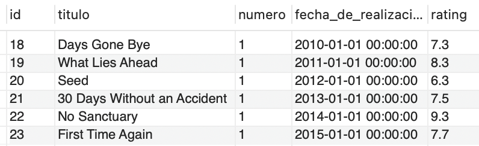
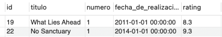

# Ejercicio 9 - Tablas Temporales

## Con la base de datos “movies”, se propone crear una tabla temporal llamada “TWD” y guardar en la misma los episodios de todas las temporadas de “The Walking Dead”.


### Creación de la tabla temporal
```sql
CREATE TEMPORARY TABLE TWD (
  `id` int(10) unsigned NOT NULL AUTO_INCREMENT,
  `titulo` varchar(500) COLLATE utf8_unicode_ci DEFAULT NULL,
  `numero` int(10) unsigned DEFAULT NULL,
  `fecha_de_realización` datetime NOT NULL,
  `rating` decimal(3,1) NOT NULL,
  PRIMARY KEY (`id`)
);
```

### Cargue de datos

```sql
INSERT INTO TWD 
SELECT ep.id, ep.title, ep.number, ep.release_date, ep.rating
FROM episodes ep 
    INNER JOIN seasons sea ON ep.season_id = sea.id 
    INNER JOIN series se ON sea.serie_id = se.id
WHERE se.title LIKE 'The Walking Dead';
```

## Realizar una consulta a la tabla temporal para ver los episodios de la primera temporada.

Obtención de todos los datos de la tabla

```sql
SELECT ep.id, ep.titulo, ep.numero, ep.fecha_de_realización, ep.rating
FROM TWD ep;
```

**Resultado**




## Consulta extra

```sql
SELECT ep.id, ep.titulo, ep.numero, ep.fecha_de_realización, ep.rating 
FROM TWD ep
WHERE rating > 5;
```


