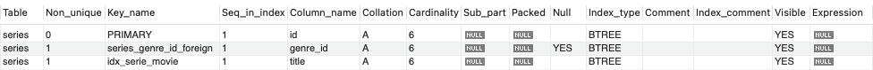

# Ejercicio 10 - Índices


* En la base de datos “movies”, seleccionar una tabla donde crear un índice y luego chequear la creación del mismo.

```sql
CREATE INDEX idx_serie_movie ON series(title);
```



* Analizar por qué crearía un índice en la tabla indicada y con qué criterio se elige/n el/los campos.

Se optó por analizar la creación de un índice en la tabla '**series**', centrándose en el atributo '**title**'. Esta elección al considerar que esta tabla probablemente no tenga cambios de manera frecuente tras haber ingresado los datos iniciales. Sin embargo, es probable que la consulta de series filtradas por el titulo sea una operación constante, ya que los usuarios suelen hacer búsquedas en datos que conocen como el nombre más que por el id (que no conocen) que si cuenta con una indexación natural, por lo cual decidimos que esta es la mejor opción.
