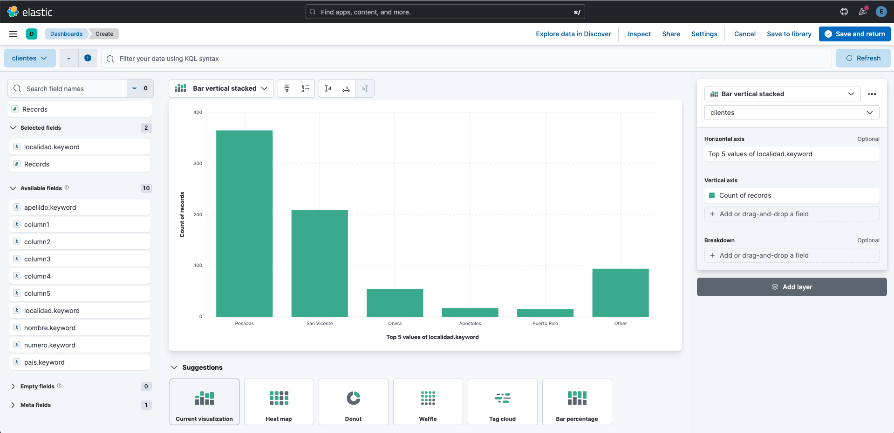
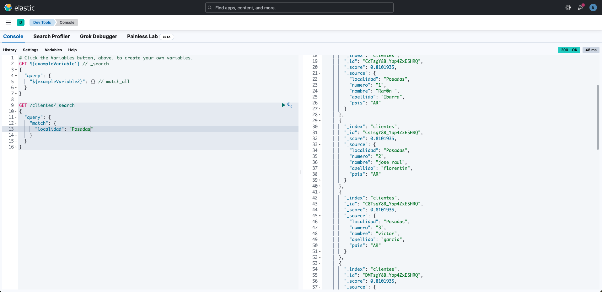
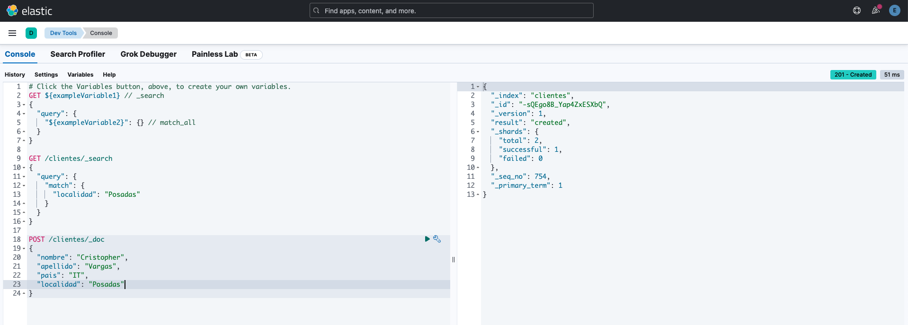
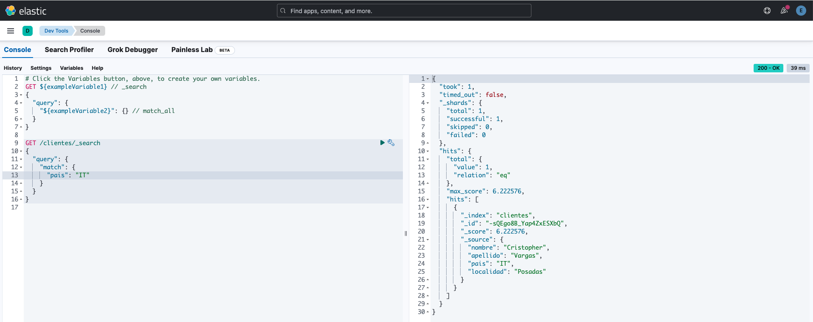
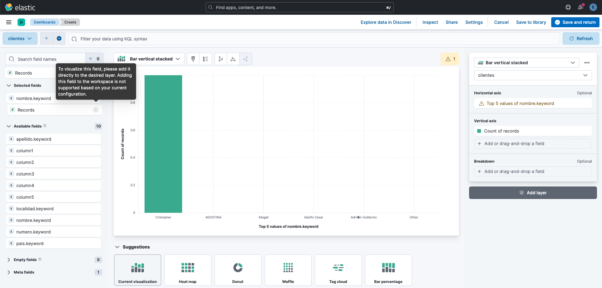

# Elasticsearch - Kibana: Clientes-Misiones

## Visualización de datos en el dashboard

## Visualización de datos con el devtools

## Crear un nuevo registro

## Visualizar nuevo registro con devtools

## Visualizar nuevo registro en el dashboard

