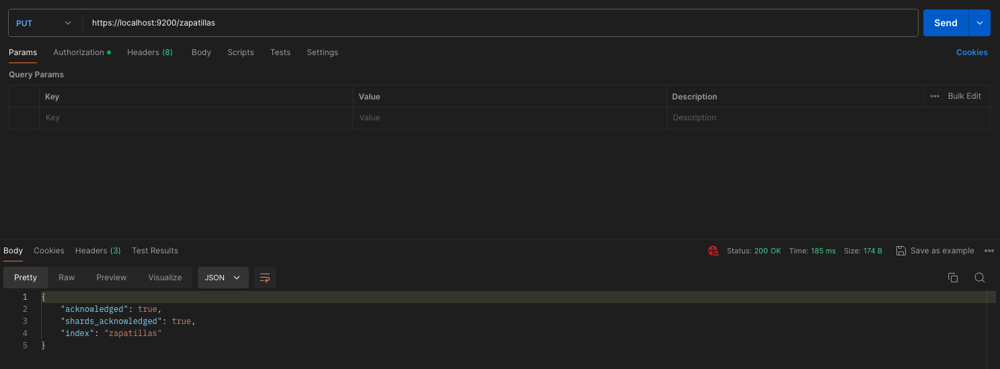
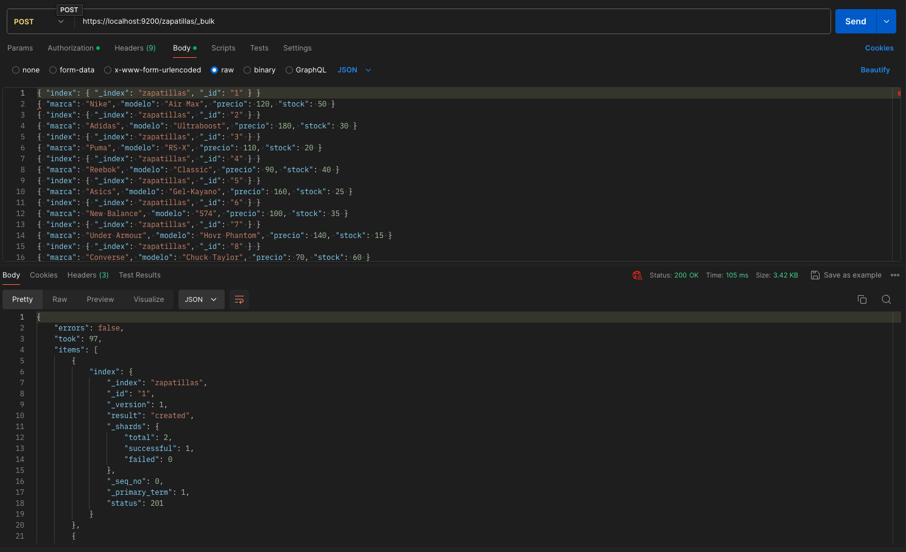
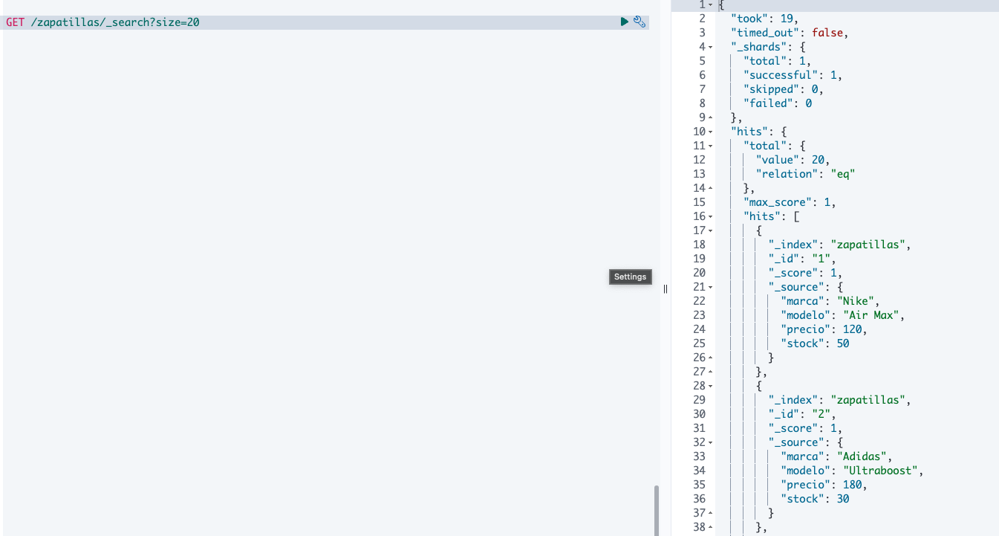

# Elasticsearch

## Base de datos - Productos: zapatillas deportivas

### Se solicita crear un índice (BBDD) en Elasticsearch, de zapatillas deportivas, donde se guardará información relacionada a estos productos.

```JSON
PUT /zapatillas
```

**Resultado**



### Guardar 20 registros en la base de datos creada, considerando los campos que crea necesarios.

```JSON
POST /zapatillas/_bulk
{ "index": { "_index": "zapatillas", "_id": "1" } }
{ "marca": "Nike", "modelo": "Air Max", "precio": 120, "stock": 50 }
{ "index": { "_index": "zapatillas", "_id": "2" } }
{ "marca": "Adidas", "modelo": "Ultraboost", "precio": 180, "stock": 30 }
{ "index": { "_index": "zapatillas", "_id": "3" } }
{ "marca": "Puma", "modelo": "RS-X", "precio": 110, "stock": 20 }
{ "index": { "_index": "zapatillas", "_id": "4" } }
{ "marca": "Reebok", "modelo": "Classic", "precio": 90, "stock": 40 }
{ "index": { "_index": "zapatillas", "_id": "5" } }
{ "marca": "Asics", "modelo": "Gel-Kayano", "precio": 160, "stock": 25 }
{ "index": { "_index": "zapatillas", "_id": "6" } }
{ "marca": "New Balance", "modelo": "574", "precio": 100, "stock": 35 }
{ "index": { "_index": "zapatillas", "_id": "7" } }
{ "marca": "Under Armour", "modelo": "Hovr Phantom", "precio": 140, "stock": 15 }
{ "index": { "_index": "zapatillas", "_id": "8" } }
{ "marca": "Converse", "modelo": "Chuck Taylor", "precio": 70, "stock": 60 }
{ "index": { "_index": "zapatillas", "_id": "9" } }
{ "marca": "Vans", "modelo": "Old Skool", "precio": 65, "stock": 45 }
{ "index": { "_index": "zapatillas", "_id": "10" } }
{ "marca": "Fila", "modelo": "Disruptor", "precio": 75, "stock": 50 }
{ "index": { "_index": "zapatillas", "_id": "11" } }
{ "marca": "Mizuno", "modelo": "Wave Rider", "precio": 150, "stock": 22 }
{ "index": { "_index": "zapatillas", "_id": "12" } }
{ "marca": "Saucony", "modelo": "Jazz Original", "precio": 90, "stock": 30 }
{ "index": { "_index": "zapatillas", "_id": "13" } }
{ "marca": "Brooks", "modelo": "Ghost 13", "precio": 130, "stock": 18 }
{ "index": { "_index": "zapatillas", "_id": "14" } }
{ "marca": "Salomon", "modelo": "Speedcross 5", "precio": 170, "stock": 25 }
{ "index": { "_index": "zapatillas", "_id": "15" } }
{ "marca": "Hoka One One", "modelo": "Clifton 7", "precio": 140, "stock": 20 }
{ "index": { "_index": "zapatillas", "_id": "16" } }
{ "marca": "Merrell", "modelo": "Trail Glove 5", "precio": 120, "stock": 35 }
{ "index": { "_index": "zapatillas", "_id": "17" } }
{ "marca": "On", "modelo": "Cloud X", "precio": 130, "stock": 27 }
{ "index": { "_index": "zapatillas", "_id": "18" } }
{ "marca": "Altra", "modelo": "Escalante", "precio": 140, "stock": 19 }
{ "index": { "_index": "zapatillas", "_id": "19" } }
{ "marca": "Skechers", "modelo": "GOrun", "precio": 85, "stock": 50 }
{ "index": { "_index": "zapatillas", "_id": "20" } }
{ "marca": "Newton", "modelo": "Gravity", "precio": 160, "stock": 15 }
```

**Resultado**



### Comprobar con consultas los registros insertados en la nueva base de datos.

```JSON
GET /zapatillas/_search?size=20
```

**Resultado**

