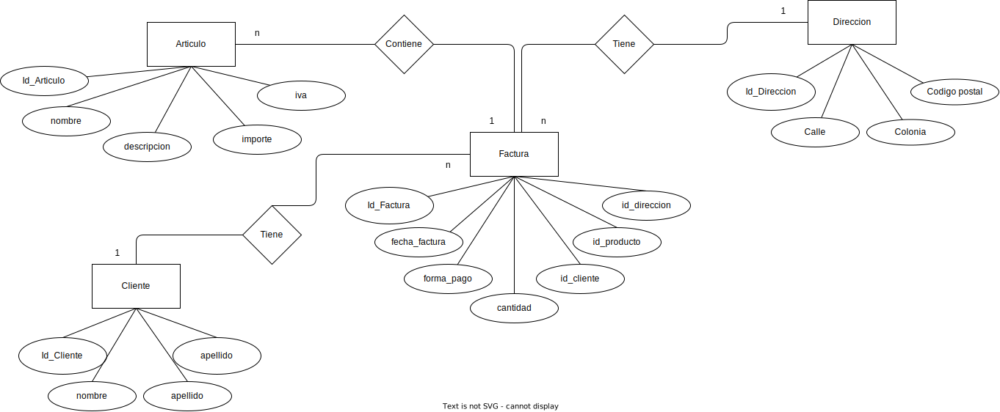

# Explicacion ejercicio de tabla 

- **Descripcion tabla: Facturas**
    - id_factura: int(11)
    - fecha_factura: date 
    - forma_pago: decimal(10.0) 
    - IVA: decimal(10.0)
    - cantidad: int(11)
    - importe: decimal(10.0)
    - nombre_cliente: varchar(40)
    - apellido_cliente: varchar(40)
    - direccion_cliente: varchar(40)
    - descripcion_articulo: varchar(40)

# Explicacion 
Al momento de aplicar la tercera forma normal, se debe de considerar que para llegar a la tercera forma se debe de cumplir con la 1FN y 2FN. Asi que debemos comenzar por verificar si se cumple la 1FN 

### 1. 1FN (Atomicidad de datos)
SI CUMPLE: la primera forma normal se cumple, ya que no existen celdas con mas de dos valores 

### 2. 2FN (Que cada dato no clave, dependa de la clave primaria)
NO CUMPLE: la segunda forma normal no se cumple que aquellos datos no clave dependan unicamente de la clave primaria, aquellos datos que no se relacionan de manera directa con la clave primaria son: `importe`, `iva`, `nombre_cliente`, `apellido_cliente`, `direccion_cliente`, `descripcion_articulo`. Estos datos deben de contemplarse dentro de sus unicas tablas. 

Suponiendo que aplicamos la segunda forma normal a la tabla original de facturas debe de resultar en 3 tablas 

- **Cliente**
    - id_cliente 
    - nombre 
    - apellido 
    - direccion 

- **articulo**
    - id_articulo 
    - descripcion 
    - importe 
    - IVA 

- **factura**
    - id_factura
    - fecha_factura 
    - forma_pago 
    - cantidad
    - id_cliente 
    - id_articulo 

### 3. 3FN - Eliminación de dependencias transitivas:
Una vez separados los datos en tres tablas independientes, es necesario garantizar que no existan dependencias transitivas en ninguna de ellas. Sin embargo, al analizar la tabla de `Cliente`, se observa que la `dirección` del cliente podría presentar múltiples valores y, por lo tanto, no depende directamente de la `clave primaria (id_cliente)`. Para corregir esto, se propone separar la información de dirección en una tabla independiente, que esté relacionada con la tabla de `Cliente` a través de una clave foránea `(id_cliente)`.

En resumen, al aplicar la tercera forma normal a la tabla de `Facturas`, se realizaron las adecuaciones necesarias para garantizar una estructura de base de datos optimizada y libre de redundancias, cumpliendo así con los principios de normalización de bases de datos.

- **Cliente**
    - id_cliente 
    - nombre 
    - apellido 

- **direccion**
    - id_direccion 
    - calle 
    - colonia 
    - pais 
    - codigo_postal 
    - id_cliente 

- **articulo**
    - id_articulo 
    - descripcion 
    - importe 
    - IVA 

- **factura**
    - id_factura
    - fecha_factura 
    - forma_pago 
    - cantidad
    - id_cliente 
    - id_articulo 
    - id_direccion 

