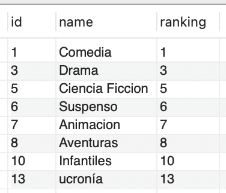
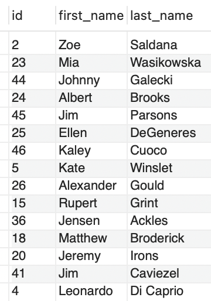
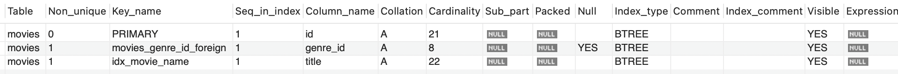
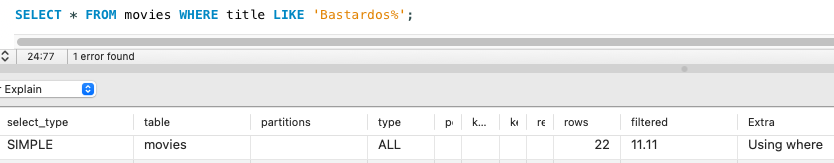
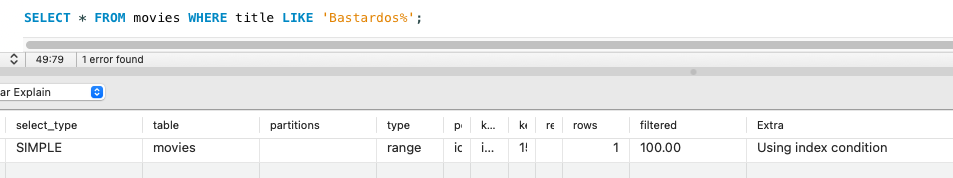

# Ejercicio 11 - Consultas SQL Avanzadas

Tomando la base de datos movies_db.sql, se solicita:


## Consultas

### Agregar una película a la tabla movies.

```sql
INSERT INTO movies (id, title, rating, awards, release_date, length)
VALUES  (22, 'Bastardos sin Gloria', 8.3, 4, '2009-08-21', 150);
```

### Agregar un género a la tabla genres.

```sql
INSERT INTO genres (id, name, ranking, active)
VALUES (13, 'ucronía', 13, 1);
```

### Asociar a la película del punto 1. genre el género creado en el punto 2.

```sql
UPDATE movies
SET genre_id = 13
WHERE id = 22;
```

### Modificar la tabla actors para que al menos un actor tenga como favorita la película agregada en el punto 1.

```sql
UPDATE actors
SET favorite_movie_id = 22
WHERE id = 4;
```

### Crear una tabla temporal copia de la tabla movies.

```sql
CREATE TEMPORARY TABLE moviesTemp(
  `id` int(10) unsigned NOT NULL AUTO_INCREMENT,
  `created_at` timestamp NULL DEFAULT NULL,
  `updated_at` timestamp NULL DEFAULT NULL,
  `title` varchar(500) COLLATE utf8_unicode_ci DEFAULT NULL,
  `rating` decimal(3,1) unsigned NOT NULL,
  `awards` int(10) unsigned NOT NULL DEFAULT '0',
  `release_date` datetime NOT NULL,
  `length` int(10) unsigned DEFAULT NULL,
  `genre_id` int(10) unsigned DEFAULT NULL,
  PRIMARY KEY (`id`)
); 
```

### Eliminar de esa tabla temporal todas las películas que hayan ganado menos de 5 awards.

```sql
DELETE FROM moviesTemp 
WHERE awards < 5;
```

### Obtener la lista de todos los géneros que tengan al menos una película.

```sql
SELECT DISTINCT ge.id, ge.name, ge.ranking
FROM genres ge INNER JOIN movies mo ON mo.genre_id = ge.id;
```

**Resultado**



### Obtener la lista de actores cuya película favorita haya ganado más de 3 awards.

```sql
SELECT ac.id, ac.first_name, ac.last_name 
FROM movies mo INNER JOIN actors ac ON ac.favorite_movie_id = mo.id
WHERE mo.awards > 3;
```

**Resultado**



### Crear un índice sobre el nombre en la tabla movies.

```sql
CREATE INDEX idx_movie_name ON movies(title);
```

### Chequee que el índice fue creado correctamente.

```sql
SHOW INDEX FROM movies;
```

**Resultado**



### En la base de datos movies ¿Existiría una mejora notable al crear índices? Analizar y justificar la respuesta.

Considerando que podría darse la búsqueda constante de películas por medio de su nombre y que no es una tabla que cambie mucho, si consideramos que sería conveniente agregarle un indice a dicha columna ya que como se puede observar en las imagenes la búsqueda paso de recorrer 22 filas a una sola y esto pensando que más adelante podrían haber insertadas más de mil peliculas o más.

Comportamiento sin indices: Recorre 22 filas



Comportamiento con indices: Recorre 1 fila



### ¿En qué otra tabla crearía un índice y por qué? Justificar la respuesta

Con base en el mismo criterio que mencionamos antes, haríamos lo mismo con las series, de indexar su nombre además de indexar por nombre a los actores pensando que muchos de los filtros se darían por medio de esto.

