# Ejercicio 3 - images/Consultas a base de datos 

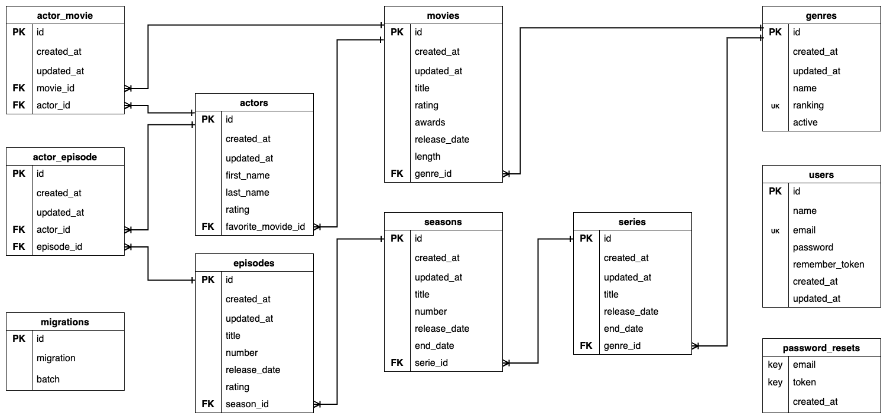

Se propone realizar las siguientes consultas a la base de datos movies_db.sql. Importar el archivo movies_db.sql desde PHPMyAdmin o MySQL Workbench y resolver las siguientes consultas:

## Consultas

### Mostrar todos los registros de la tabla de movies.

```sql
SELECT id, created_at, updated_at, title, rating, awards, release_date, length, genre_id 
FROM movies;
```

Resultado:

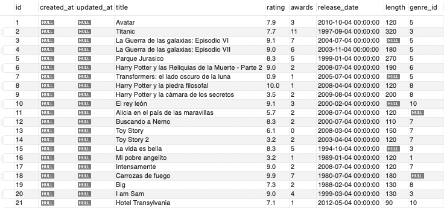

### Mostrar el nombre, apellido y rating de todos los actores.

```sql
SELECT first_name, last_name, rating 
FROM actors;
```

Resultado:

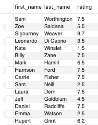

### Mostrar el título de todas las series y usar alias para que tanto el nombre de la tabla como el campo estén en español.

```sql
SELECT se.title AS "Titulo de la serie" 
FROM series AS se;
```

Resultado:

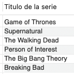

### Mostrar el nombre y apellido de los actores cuyo rating sea mayor a 7.5.

```sql
SELECT ac.first_name, ac.last_name, ac.rating
FROM actors AS ac
WHERE rating > 7.5;
```

Resultado:

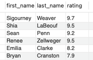

### Mostrar el título de las películas, el rating y los premios de las películas con un rating mayor a 7.5 y con más de dos premios.

```sql
SELECT mo.title AS Titulo, mo.rating AS Rating, mo.awards AS Premios
FROM movies AS mo
WHERE rating > 7.5 AND awards > 2;
```

Resultado:

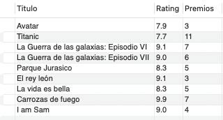

### Mostrar el título de las películas y el rating ordenadas por rating en forma ascendente.

```sql
SELECT mo.title AS Titulo, mo.rating AS Rating
FROM movies AS mo
ORDER BY mo.rating ASC;
```

Resultado:

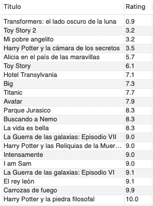

### Mostrar los títulos de las primeras tres películas en la base de datos.

```sql
SELECT mo.title AS Titulo
FROM movies AS mo
LIMIT 3;
```

Resultado:

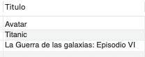

### Mostrar el top 5 de las películas con mayor rating.

```sql
SELECT mo.title AS Titulo
FROM movies AS mo
ORDER BY mo.rating DESC
LIMIT 5;
```

Resultado:

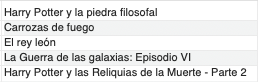

### Listar los primeros 10 actores.

```sql
SELECT CONCAT(ac.first_name, ' ', ac.last_name) AS Actor
FROM actors AS ac
LIMIT 10;
```

Resultado:

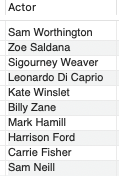

### Mostrar el título y rating de todas las películas cuyo título sea de Toy Story.

```sql
SELECT mo.title AS Titulo, mo.rating AS Rating 
FROM movies AS mo
WHERE LOWER(mo.title) LIKE LOWER('Toy Story');
```

Resultado:

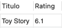

### Mostrar a todos los actores cuyos nombres empiezan con Sam.

```sql
SELECT CONCAT(ac.first_name, ' ', ac.last_name) AS Actor
FROM actors AS ac
WHERE LOWER(ac.first_name) LIKE LOWER('Sam%'); 
```

Resultado:

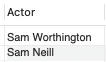

### Mostrar el título de las películas que salieron entre el 2004 y 2008.

```sql
SELECT mo.title AS Titulo
FROM movies AS mo
WHERE YEAR(mo.release_date) BETWEEN 2004 AND 2008;
```

Resultado:

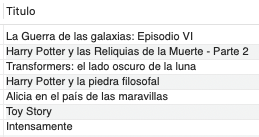

### Traer el título de las películas con el rating mayor a 3, con más de 1 premio y con fecha de lanzamiento entre el año 1988 al 2009. Ordenar los resultados por rating.

```sql
SELECT mo.title AS Titulo
FROM movies AS mo
WHERE mo.rating > 3 AND mo.awards > 1 AND YEAR(mo.release_date) BETWEEN 1988 AND 2009
ORDER BY mo.rating;
```

Resultado:

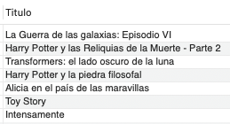
