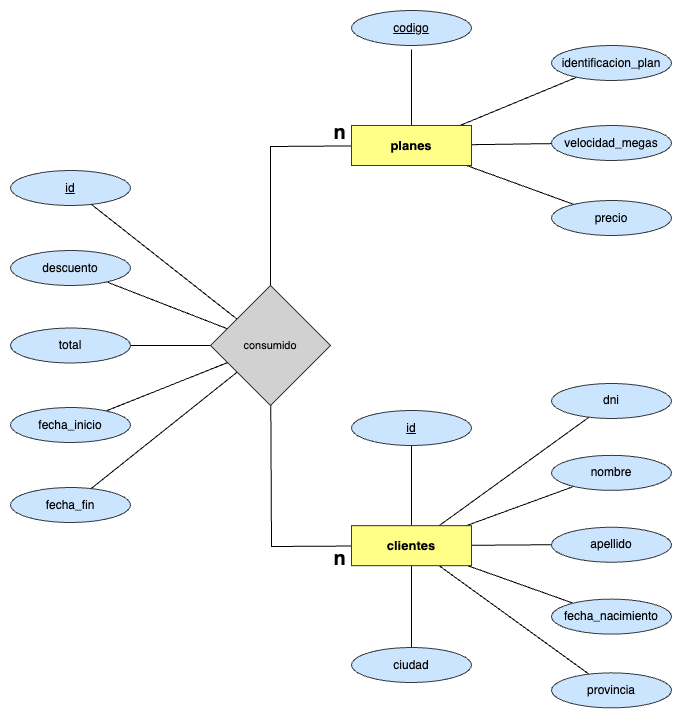
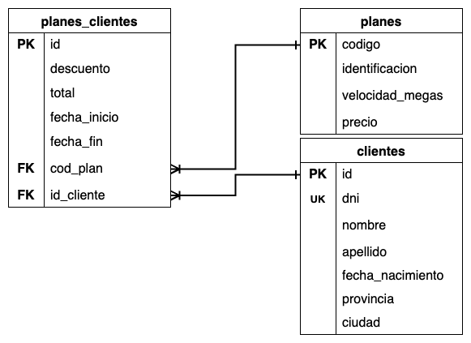
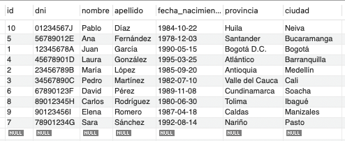
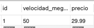
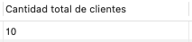
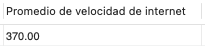
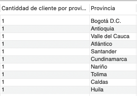
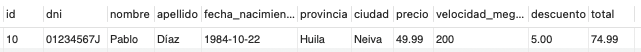
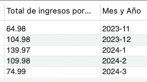
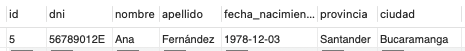

# Ejercicio 4 - Plan de internet

Una empresa proveedora de Internet necesita una base de datos para almacenar cada uno de sus clientes junto con el plan/pack que tiene contratado. Mediante un análisis previo se conoce que se tiene que almacenar la siguiente información:

* De los clientes se debe registrar: dni, nombre, apellido, fecha de nacimiento, provincia, ciudad.
* En cuanto a los planes de internet: identificación del plan, velocidad ofrecida en megas, precio, descuento.

## Ejercicio 1

Luego del planteo de los requerimientos de la empresa, se solicita modelar los mismos mediante un DER (Diagrama Entidad-Relación).

### Diagrama Entidad - Relación



### Diagrama Relacional



## Ejercicio 2

Una vez modelada y planteada la base de datos, responder a las siguientes preguntas:

* ¿Cuál es la primary key para la tabla de clientes? Justificar respuesta

**Respuesta:** La PK de la tabla clientes es un **id** diferente al *dni* por dos razones principales, la primera es **seguridad**, debido a que la *PK* podría ser un atributo que se utilice para muchas consultas y a lo mejor transmitido en diferentes canales y al ser el *dni* un dato sensible no se debe exponer a una posible filtración. La segunda razón podría ser la de **adaptabilidiad**, ya que podría darse el caso que la empresa preste servicios en otros paises cuyas reglas para identificar a las personas sea diferente entre país y país.

* ¿Cuál es la primary key para la tabla de planes de internet? Justificar respuesta.

**Respuesta:** Si bien el ejercicio propone un **identificador**, creamos un id diferente denominado **código** extra, ya que se debatió y se llegó a que dicho identificador podría ser el nombre del plan, la forma en la que se le presenta a los clientes.

* ¿Cómo serían las relaciones entre tablas? ¿En qué tabla debería haber foreign key? ¿A qué campo de qué tabla hace referencia dicha foreign key? Justificar respuesta.

**Respuesta:** Considero que podría haber una relación entre la tabla clientes y planes de cardinalidad **Muchos a Muchos**, ya que un plan podría ser consumido por muchos clientes y a la vez cada cliente podría tener muchos planes, por lo cual habría una tabla intermedia (o de rompimiento) que cuente con **FK** de cada una de las tablas, el id propio de su tabla y las fechas que determinen la duración de cada uno de los servicios, también pienso que esta tabla podría ser la que cuente con el descuento y con el total de la compra, siendo este un atributo derivado (o calculado).

## Ejercicio 3 

Una vez realizado el planteo del diagrama y de haber respondido estas preguntas, utilizar PHPMyAdmin o MySQL Workbench para ejecutar lo siguiente:

* Se solicita crear una nueva base de datos llamada “empresa_internet”.

```sql
CREATE DATABASE empresa_internet;

USE empresa_internet;

CREATE TABLE clientes
(
    id INT UNSIGNED AUTO_INCREMENT PRIMARY KEY,
    dni VARCHAR(20) NOT NULL,
    nombre VARCHAR(100) NOT NULL,
    apellido VARCHAR(100) NOT NULL,
    fecha_nacimiento DATE NOT NULL,
    provincia VARCHAR(100),
    ciudad VARCHAR(100)
);

CREATE TABLE planes
(
    codigo INT UNSIGNED AUTO_INCREMENT PRIMARY KEY,
    identificacion VARCHAR(250) NOT NULL,
    velocidad_megas INT UNSIGNED NOT NULL,
    precio DECIMAL(10, 2) NOT NULL
);

CREATE TABLE planes_clientes
(
    id INT UNSIGNED AUTO_INCREMENT PRIMARY KEY,
    descuento DECIMAL(10, 2) NOT NULL,
    total DECIMAL(10, 2) NOT NULL,
    fecha_inicio DATE NOT NULL,
    fecha_fin DATE NOT NULL,
    cod_plan INT UNSIGNED NOT NULL,
    id_cliente INT UNSIGNED NOT NULL,
    FOREIGN KEY (cod_plan) REFERENCES planes (codigo),
    FOREIGN KEY (id_cliente) REFERENCES clientes (id)
);

```

* Incorporar 10 registros en la tabla de clientes y 5 en la tabla de planes de internet.

```sql
INSERT INTO clientes (dni, nombre, apellido, fecha_nacimiento, provincia, ciudad) 
VALUES 
    ('12345678A', 'Juan', 'García', '1990-05-15', 'Bogotá D.C.', 'Bogotá'),
    ('23456789B', 'María', 'López', '1985-09-20', 'Antioquia', 'Medellín'),
    ('34567890C', 'Pedro', 'Martínez', '1982-07-10', 'Valle del Cauca', 'Cali'),
    ('45678901D', 'Laura', 'González', '1995-03-25', 'Atlántico', 'Barranquilla'),
    ('56789012E', 'Ana', 'Fernández', '1978-12-03', 'Bogotá D.C.', 'Bogotá'),
    ('67890123F', 'David', 'Pérez', '1989-11-08', 'Cundinamarca', 'Soacha'),
    ('78901234G', 'Sara', 'Sánchez', '1992-08-14', 'Nariño', 'Pasto'),
    ('89012345H', 'Carlos', 'Rodríguez', '1980-06-30', 'Bogotá D.C.', 'Bogotá'),
    ('90123456I', 'Elena', 'Romero', '1987-04-18', 'Caldas', 'Manizales'),
    ('01234567J', 'Pablo', 'Díaz', '1984-10-22', 'Huila', 'Neiva');


INSERT INTO planes (identificacion, velocidad_megas, precio)
VALUES 
    ('Plan Básico', 50, 29.99),
    ('Plan Estándar', 100, 39.99),
    ('Plan Avanzado', 200, 49.99),
    ('Plan Premium', 500, 59.99),
    ('Plan Ultimate', 1000, 79.99);

INSERT INTO planes_clientes (descuento, total, fecha_inicio, fecha_fin, cod_plan, id_cliente)
VALUES 
    (5.00, 24.99, '2023-11-10', '2024-03-15', 1, 1),
    (0.00, 39.99, '2023-11-20', '2024-04-25', 2, 2),
    (10.00, 44.99, '2023-12-05', '2024-03-30', 3, 3),
    (0.00, 59.99, '2023-12-15', '2024-04-05', 4, 4),
    (8.00, 71.99, '2024-01-01', '2024-04-10', 5, 5),
    (0.00, 29.99, '2024-01-10', '2024-04-20', 1, 6),
    (12.00, 37.99, '2024-01-20', '2024-04-30', 2, 7),
    (0.00, 59.99, '2024-02-05', '2024-04-15', 3, 8),
    (0.00, 49.99, '2024-02-15', '2024-04-25', 3, 9),
    (5.00, 74.99, '2024-03-01', '2024-04-30', 3, 10);
```

## Ejercicio 4

Plantear 10 consultas SQL que se podrían realizar a la base de datos. Expresar las sentencias.

### 1: Mostrar todos los clientes ordenados alfabéticamente por apellido y nombre.

```sql
SELECT cl.id, cl.dni, cl.nombre, cl.apellido, cl.fecha_nacimiento, cl.provincia, cl.ciudad
FROM clientes cl
ORDER BY cl.apellido, cl.nombre;
```

**Resultado:**



### 2: Encontrar el plan de internet más económico y mostrar su velocidad y precio.

```sql
SELECT pl.id, pl.velocidad_megas, pl.precio
FROM planes pl
ORDER BY pl.precio
LIMIT 1;
```

**Resultado:**



### 3: Calcular la cantidad total de clientes registrados en la base de datos.

```sql
SELECT COUNT(id) AS "Cantidad total de clientes"
FROM clientes;
```

**Resultado:**



### 4: Calcular el promedio de velocidad de internet ofrecido por todos los planes disponibles.

```sql
SELECT ROUND(AVG(pl.velocidad_megas), 2) AS "Promedio de velocidad de internet"
FROM planes pl;
```

**Resultado:**



### 5: Mostrar la cantidad total de clientes por provincia y ordenar los resultados de manera descendente.

```sql
SELECT COUNT(cl.id) AS "Cantiddad de cliente por provincia", cl.provincia AS "Provincia"
FROM clientes cl
GROUP BY cl.provincia;
```

**Resultado:**

v

### 6: Encontrar el cliente con el plan más caro y mostrar sus detalles, incluyendo detalles del servicio.

```sql
SELECT cl.id, cl.dni, cl.nombre, cl.apellido, cl.fecha_nacimiento, cl.provincia, cl.ciudad, pl.precio, pl.velocidad_megas, pc.descuento, pc.total
FROM clientes cl, planes_clientes pc, planes pl
WHERE pc.id_cliente = cl.id AND pc.id_plan = pl.id
ORDER BY pc.total DESC
LIMIT 1;
```

**Resultado:**



### 7: Calcular el total de ingresos mensuales obtenidos por la empresa en los últimos seis meses.

```sql
SELECT SUM(pc.total) AS "Total de ingresos por mes", 
       CONCAT(YEAR(pc.fecha_inicio), '-', MONTH(pc.fecha_inicio)) AS "Mes y Año"
FROM planes_clientes pc
WHERE pc.fecha_inicio >= DATE_SUB(CURRENT_DATE(), INTERVAL 6 MONTH)
GROUP BY CONCAT(YEAR(pc.fecha_inicio), '-', MONTH(pc.fecha_inicio));
```

**Resultado:**



### 8: Identificar el plan más popular entre los clientes y mostrar cuántos clientes lo han contratado.

```sql
SELECT pl.nombre AS "Nombre del plan", COUNT(pl.id) AS "Cantidad"
FROM planes_clientes pc, planes pl
WHERE pc.id_plan = pl.id
GROUP BY pl.nombre
ORDER BY COUNT(pl.id) DESC
LIMIT 1;
```

**Resultado:**


### 9: Identificar la provincia con la mayor cantidad de clientes registrados.

```sql
SELECT cl.provincia AS "Provincia", COUNT(cl.provincia) AS "Cantidad de clientes" 
FROM clientes cl
GROUP BY cl.provincia
ORDER BY COUNT(cl.provincia) DESC
LIMIT 1;
```

**Resultado:**


### 10: Encontrar el cliente más joven registrado en la base de datos y mostrar sus detalles.

```sql
SELECT cl.id, cl.dni, cl.nombre, cl.apellido, cl.fecha_nacimiento, cl.provincia, cl.ciudad
FROM clientes cl
ORDER BY cl.fecha_nacimiento ASC
LIMIT 1;
```

**Resultado:**


