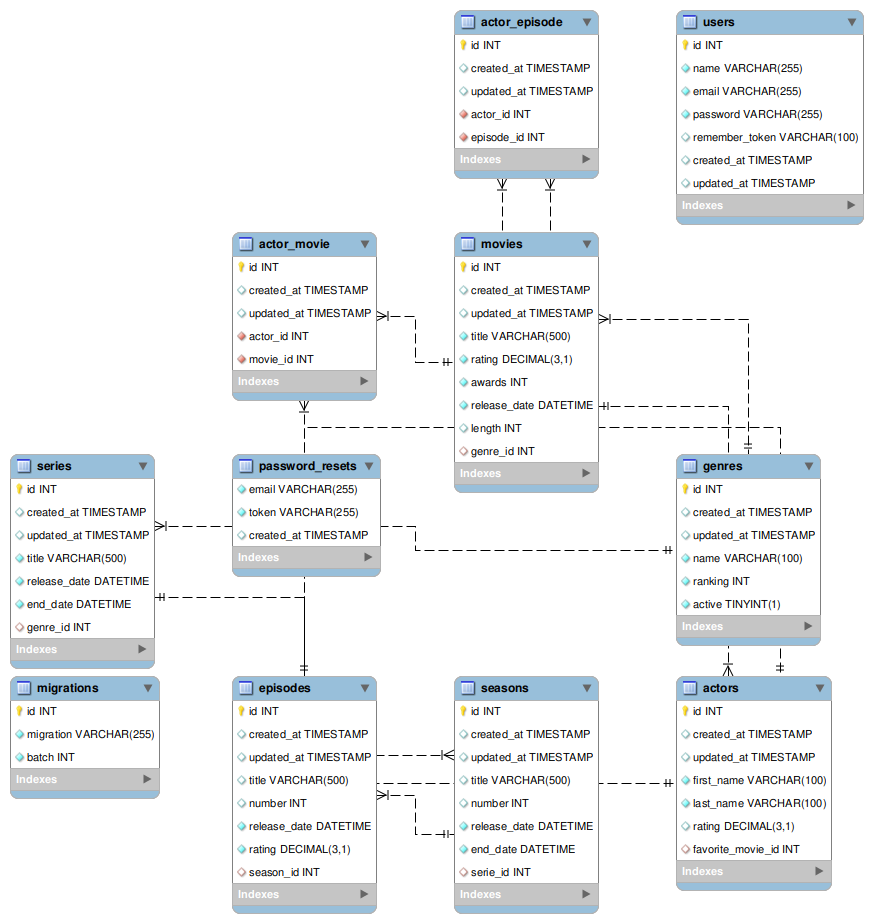
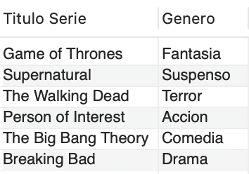
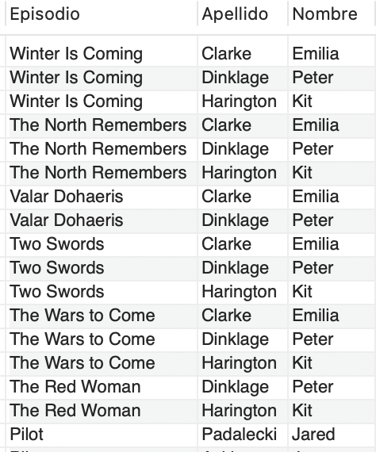
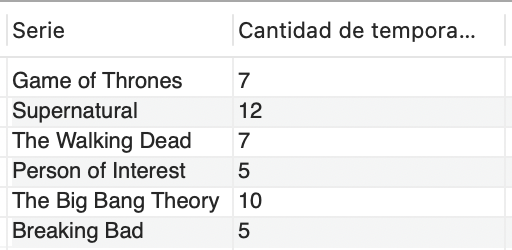
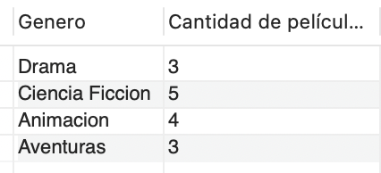
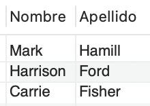

# Ejercicio 5 - Consultas SQL Avanzadas

Se propone realizar las siguientes consultas a la base de datos movies_db.sql trabajada en la primera clase.



## Consultas

### Mostrar el título y el nombre del género de todas las series.

```sql
SELECT se.title AS "Titulo Serie", ge.name AS "Genero"
FROM genres ge INNER JOIN series se ON ge.id = se.genre_id;
```

Resultado:



### Mostrar el título de los episodios, el nombre y apellido de los actores que trabajan en cada uno de ellos.

```sql
SELECT ep.title AS "Episodio", ac.last_name AS "Apellido", ac.first_name AS "Nombre"
FROM actors ac
    INNER JOIN actor_episode ae ON ac.id = ae.actor_id
    INNER JOIN episodes ep ON ae.episode_id = ep.id;
```

Resultado:



### Mostrar el título de todas las series y el total de temporadas que tiene cada una de ellas.

```sql
SELECT ser.title AS "Serie", COUNT(sea.id) AS "Cantidad de temporadas"
FROM series ser INNER JOIN seasons sea ON ser.id = sea.serie_id
GROUP BY ser.title;
```

Resultado:



### Mostrar el nombre de todos los géneros y la cantidad total de películas por cada uno, siempre que sea mayor o igual a 3.

```sql
SELECT ge.name AS "Genero", COUNT(mo.id) AS "Cantidad de películas"
FROM genres ge INNER JOIN movies mo ON ge.id = mo.genre_id
GROUP BY ge.name
HAVING COUNT(mo.id) >= 3;
```

Resultado:



### Mostrar sólo el nombre y apellido de los actores que trabajan en todas las películas de la guerra de las galaxias y que estos no se repitan.

```sql
SELECT ac.first_name AS "Nombre", ac.last_name AS "Apellido"
FROM actors ac
INNER JOIN actor_movie am ON ac.id = am.actor_id
INNER JOIN movies mo ON mo.id = am.movie_id
WHERE LOWER(mo.title) LIKE '%guerra de las galaxias%'
GROUP BY ac.id
HAVING COUNT(mo.id) = (
    SELECT COUNT(DISTINCT mo.id)
    FROM movies mo
    WHERE LOWER(mo.title) LIKE '%guerra de las galaxias%'
);
```

Resultado:



