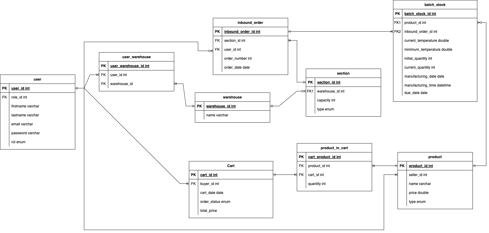
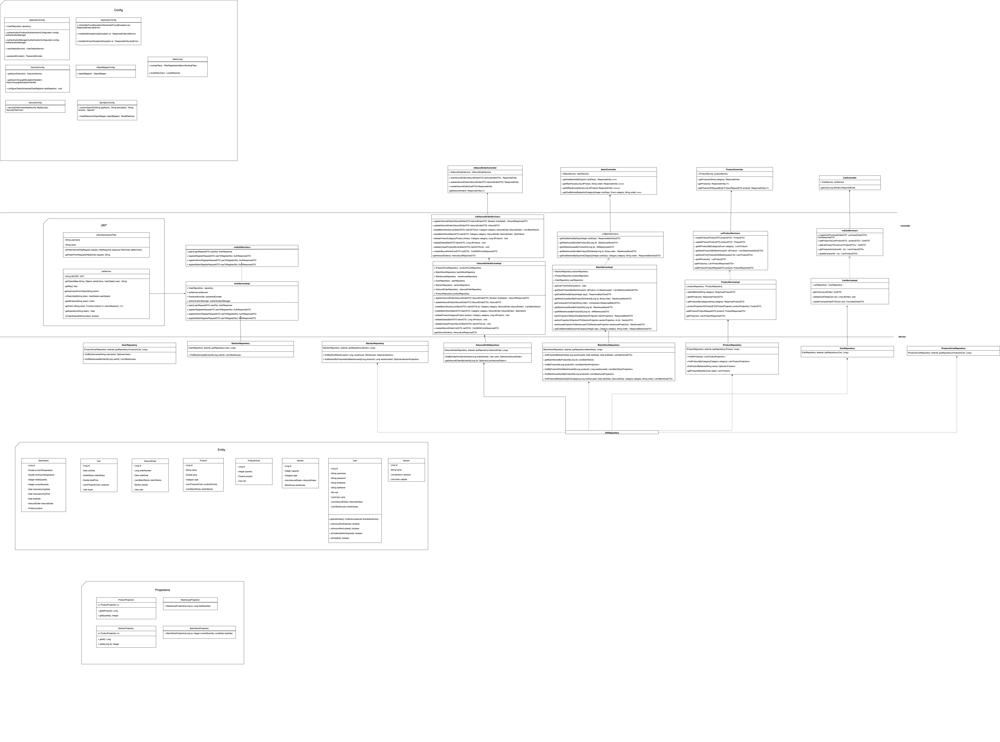

# sprint-3-team-12-malacara

# Spring Boot App model for Java 17

A warehouse management software based on Spring Boot. Serves an application designed to efficiently optimize and administer warehouse operations. Leveraging the Java Spring Boot framework, it enables agile and robust development of enterprise applications.

## Usage

### SCOPE

# Setting Application Scope

To determine the scope of your application, you should configure the environment variable `SCOPE`. The `SCOPE` variable can be set to one of the following values: `prod` for production, `test` for testing, or `local` for local development.

## Instructions

1. **Set Environment Variable:**
    - Open your Dockerfile located in root.

      ```Dockerfile
      ENV SCOPE="prod"
      ```

   Replace `"prod"` with `"test"` or `"local"` as needed.


### Historia de usuario REQ. 06

[Ver historia de usuario](https://docs.google.com/document/d/18e0eU9n4cMxjRv_in5w_8fjHZPDxv1xIoJKnTsp6ztI/edit?usp=sharing)

### ENDPOINTS
| Controller              | HTTP Method | Endpoint                                                | Description                                                                                          |
|-------------------------|-------------|---------------------------------------------------------|------------------------------------------------------------------------------------------------------|
| AuthController          | POST        | /api/v1/fresh-products/login                            | Login                                                                                                |
| AuthController          | POST        | /api/v1/fresh-products/register                         | Register                                                                                             |
| AuthController          | POST        | /api/v1/fresh-products/registerAdmin                    | Register Admin                                                                                       |
| AuthController          | POST        | /api/v1/fresh-products/registerSeller                   | Register Seller                                                                                      |
| BatchController         | GET         | /api/v1/fresh-products/batch/list/due-date/{cantDays}   | Get batches due by days                                                                              |
| BatchController         | GET         | /api/v1/fresh-products/{idProduct}/batch/list           | Get warehouse stock by product ID ordered                                                            |
| BatchController         | GET         | /api/v1/fresh-products/{idProduct}/warehouse/list       | Get all warehouse stock by product ID                                                                |
| BatchController         | GET         | /api/v1/fresh-products/batch/list/due-date/f/{cantDays} | Get due batches by days and category                                                                 |
| CartController          | GET         | /api/v1/fresh-products/orders/{idOrder}                 | Get cart by order ID                                                                                 |
| InBoundOrderController  | POST        | /api/v1/fresh-products/inboundorder                     | Create a new inbound order                                                                           |
| InBoundOrderController  | PUT         | /api/v1/fresh-products/inboundorder                     | Update an existing inbound order                                                                     |
| InBoundOrderController  | POST        | /api/v1/fresh-products/orders                           | Register an order with the list of products that make up the PurchaseOrder and calculate final price |
| InBoundOrderController  | PUT         | /api/v1/fresh-products/orders/{idOrder}                 | Update an order with the list of products that take the PurchaseOrder and calculate final price      |
| InBoundOrderController  | GET         | /api/v1/fresh-products/inboundorder                     | Get inbound orders by seller                                                                         |
| ProductController       | GET         | /api/v1/fresh-products/{idProduct}                      | Get product by ID                                                                                    |
| ProductController       | GET         | /api/v1/fresh-products/products                         | Get products by Seller                                                                               |
| ProductController       | POST        | /api/v1/fresh-products/new-product                      | Register a new product by Seller                                                                     |

## UML Diagrams

### Entity Relationship Diagram


### Class Diagram

