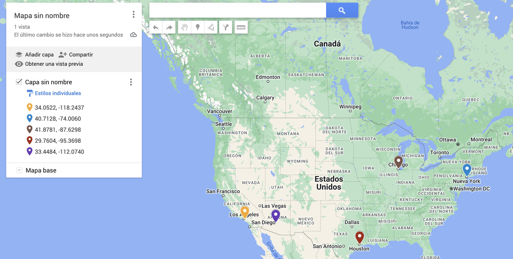
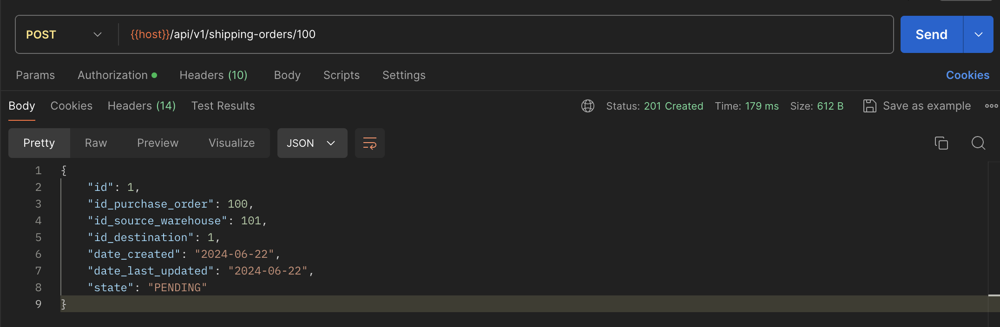

# W26-TEAM5

# Requerimiento individual

**ml-shipping-order-06**

## User Story Code: ml-shipping-order-06

## Description

As a Manager, I want to generate shipping orders so that they can be executed efficiently. This user story involves
creating and updating shipping orders to ensure products are dispatched from the nearest warehouse to the buyer and updating the state of existing shipping orders.

### Scenarios

#### Scenario 1: Generate Shipping Order
- **GIVEN** the purchase order is registered.
- **WHEN** the manager creates the shipping order based on the purchase order.
- **THEN** the shipping order is generated with the warehouse from which the order will be dispatched, which is the
  nearest to the Buyer.

#### Scenario 2: Update the State of a Shipping Order
- **GIVEN** the shipping order exists.
- **WHEN** the manager updates a shipping order state.
- **THEN** the shipping order is updated with the new state.

### Validation
- Authenticate as a Manager and access the endpoints.
- Validate required parameters.

### JSON Representation

#### Create Shipping Order Response
```json
{
  "id": "Integer",
  "id_purchase_order": "Integer",
  "id_source_warehouse": "Integer",
  "id_destination": "Integer",
  "date_created": "String",
  "date_last_updated": "String",
  "state": "String"
}
```


## HTTP Contracts

| HTTP Method | URI Template                                               | Description                                                          | US Code               |
|-------------|------------------------------------------------------------|----------------------------------------------------------------------|-----------------------|
| POST        | /api/v1/shipping-orders/{idPurchaseOrder}                  | Creates a shipping order. Returns 404 if the purchase order doesn't exist. | ml-shipping-order-06 |
| GET         | /api/v1/shipping-orders/{idShippingOrder}                  | Returns the specified shipping order. Returns 404 if it doesn't exist.  | ml-shipping-order-06 |
| POST        | /api/v1/shipping-orders/update-state/{idShippingOrder}     | Updates the state of the shipping order. Returns 404 if it doesn't exist. | ml-shipping-order-06 |
| GET         | /api/v1/shipping-orders/pending                            | Returns all shipping orders with status PENDING.                      | ml-shipping-order-06 |

## How works

Each buyer and warehouse is associated with a geographical location 
given by latitude and longitude. To determine the warehouse closest to
the buyer, the [Haversine formula](https://en.wikipedia.org/wiki/Haversine_formula)
is used, which calculates the distance in kilometers between 
two geographical points. This formula is implemented in the 
`DistanceServiceImpl` class in the method 
`getDistanceBetweenTwoLocations`.

## Example with the DATA.SQL

The following inserts are in data.sql file 

LOCATIONS
```sql
INSERT INTO location (id, longitude, latitude)
VALUES (1, 40.7128, -74.0060),
    (2, 34.0522, -118.2437),
    (3, 41.8781, -87.6298),
    (4, 29.7604, -95.3698),
    (5, 33.4484, -112.0740);
```
WAREHOUSES
```sql
INSERT INTO warehouse (id_warehouse, id_user, name, id_location)
VALUES (1, 12497864, 'Deposito Principal', 4),
       (2, 12497864, 'Deposito Sin Uso', 5),
       (100, 101, 'Main Warehouse', 2),
       (101, 101, 'Secondary Warehouse', 3);
```
The user Charlie has the **location with id 1**
and two **purchase orders with ids 100 and 101**

```sql
INSERT INTO user_entity (id_user, first_name, last_name, role, username, password, registration_date, id_location)
VALUES
(102, 'Charlie', 'Brown', 'BUYER', 'charlie', '$2a$12$/ByXEpbGgKBX.QEIm3t.yOhfeWKIW0L8qREBAhz5d2iGhNJn3Qmgu', CURRENT_TIMESTAMP, 1)

INSERT INTO purchase_order (id_purchase_order, id_user, date, status)
VALUES (100, 102, '2022-01-05', 'PENDING'),
  (101, 102, '2022-01-06', 'SHIPPED');
```

if we look at the map we can see that the **warehouse with id 101** is 
the **nearest** to the user Charlie

**Charlie is represented by the blue point on the map,
and the nearest warehouse is represented by the brown point.**



Therefore, if we execute the endpoint to create a shipping order 
with **purchase order 100**, 
the shipping order will be created using **warehouse with id 101**



If you want to try it yourself, you will need to create an account 
with a MANAGER role and execute the endpoint to create a shipping order
with a valid purchase order ID.

# Project Description

MercadoLibre aims to expand its product offerings to include fresh
products that require refrigeration. This initiative presents new
challenges in the storage, transportation, and commercialization of
these products due to their specific temperature and handling
requirements. The objective of this project is to develop a
temperature monitoring and control solution to ensure the quality
of fresh products throughout the distribution and sales process.

# Tecnologies

- Java 17
- Spring Boot
- Spring Web
- Spring Data JPA
- MySql
- H2 for local and test development
- Spring Security

### Run

To run the application, you need to execute the following command:

fury run

And the SCOPE is managed by the Dockerfile.

### SCOPE

The suffix of each Fury **SCOPE** is used to know which properties file to use, it is identified from the last '-' of the name of the scope.

If you want to run the application from your development IDE, you need to configure the environment variable **SCOPE=local** in the app luncher.

The properties of **application.yml** are always loaded and at the same time they are complemented with **application-<SCOPE_SUFFIX>.yml** properties. If a property is in both files, the one that is configured in **application-<SCOPE_SUFFIX>.yml** has preference over the property of **application.yml**.

For example, for the **SCOPE** 'items-loader-test' the **SCOPE_SUFFIX** would be 'test' and the loaded property files will be **application.yml** and **application-test.yml**

### Web Server

Each Spring Boot web application includes an embedded web server. For servlet stack applications, Its supports three web Servers:
* Tomcat (maven dependency: `spring-boot-starter-tomcat`)
* Jetty (maven dependency: `spring-boot-starter-jetty`)
* Undertow (maven dependency: `spring-boot-starter-undertow`)

This project is configured with Jetty, but to exchange WebServer, it is enough to configure the dependencies mentioned above in the pom.xml file.

### Main

The main class for this app is Application, where Spring context is initialized and SCOPE_SUFFIX is generated.

## API Documentation

This project uses OpenAPI to automate the generation of machine and human readable specifications for JSON APIs written using Spring. OpenAPI works by examining an application, once, at runtime to infer API semantics based on spring configurations, class structure and various compile time java Annotations.

You can change this configuration in SpringDocConfig class.

### Fury Specs Hub

To simplify the management and maintainability of your API specs, we present [Fury Specs Hub](https://furydocs.io/specs-hub/latest/guide/#/). Fury Specs Hub is a new service from Fury that aims to be a one-stop solution for API definition. With Specs Hub, you will be able to:
- Define your APIs using OpenAPI or AsyncAPI.
- Automate the configuration and generation of your API specs with the help of new commands from the Fury CLI.
- Have all your specs in one place for visualization and management.
- Share them with other teams.
- Find available APIs based on the information you need.
- Usage documentation [Fury Specs Hub - Getting started](https://furydocs.io/specs-hub/latest/guide/#/tutorial/).

#### Usage guide fast reference

1. [Installing the Specs Hub plugin for Fury CLI.](https://furydocs.io/specs-hub/latest/guide/#/tutorial/install-specs-hub-furycli)
2. [Installing the OpenAPI plugin and initializing a basic configuration.](https://furydocs.io/specs-hub/latest/guide/#/tutorial/install-open-api)
3. [Generating your first API specification.](https://furydocs.io/specs-hub/latest/guide/#/tutorial/generate-open-api-spec)
4. [Validating your API specification.](https://furydocs.io/specs-hub/latest/guide/#/tutorial/validate-specs)
5. [Uploading your first specification.](https://furydocs.io/specs-hub/latest/guide/#/tutorial/upload-spec)
6. [Viewing your specification in Fury web.](https://furydocs.io/specs-hub/latest/guide/#/tutorial/view-spec)
7. [Managing your specification in Fury web.](https://furydocs.io/specs-hub/latest/guide/#/tutorial/manage-spec)

## [Release Process](https://release-process.furycloud.io/#/)

### Usage

1. Specify the correct tag for your app in your `Dockerfile` and `Dockerfile.runtime`, according to the desired Java runtime version.

```
# Dockerfile
FROM hub.furycloud.io/mercadolibre/java:17-mini
```

You can find all available tags for your `Dockerfile` [here](https://github.com/mercadolibre/fury_java-mini#supported-tags)

```
# Dockerfile.runtime
FROM hub.furycloud.io/mercadolibre/java:17-runtime-mini
```

You can find all available tags for your `Dockerfile.runtime` [here](https://github.com/mercadolibre/fury_java-mini-runtime#supported-tags)

2. Start coding!

### Questions

[Release Process Issue Tracker](https://github.com/mercadolibre/fury_release-process/issues)
