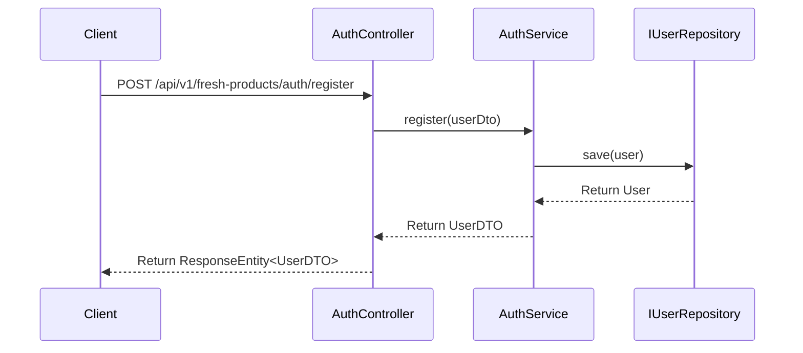
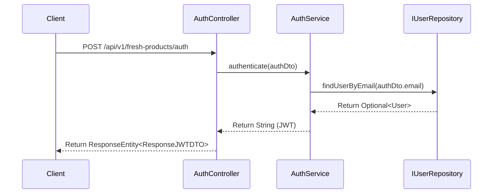
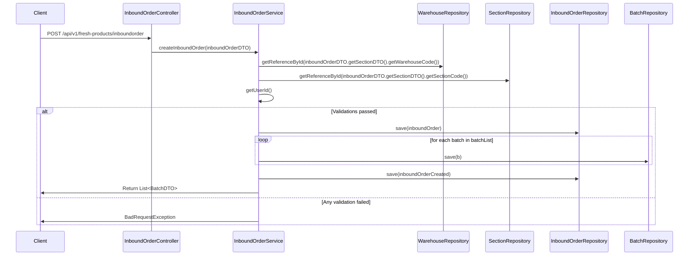
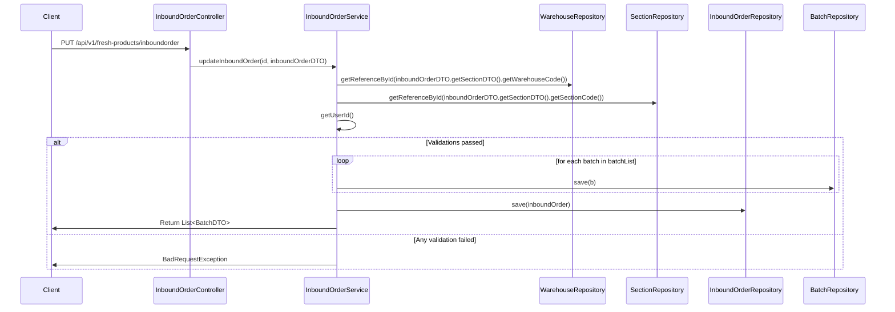
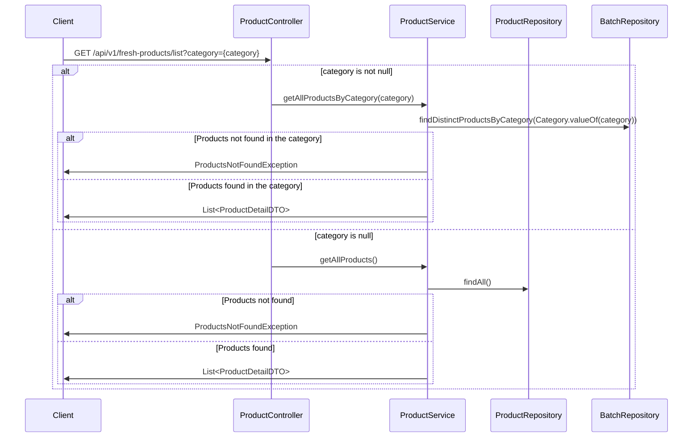
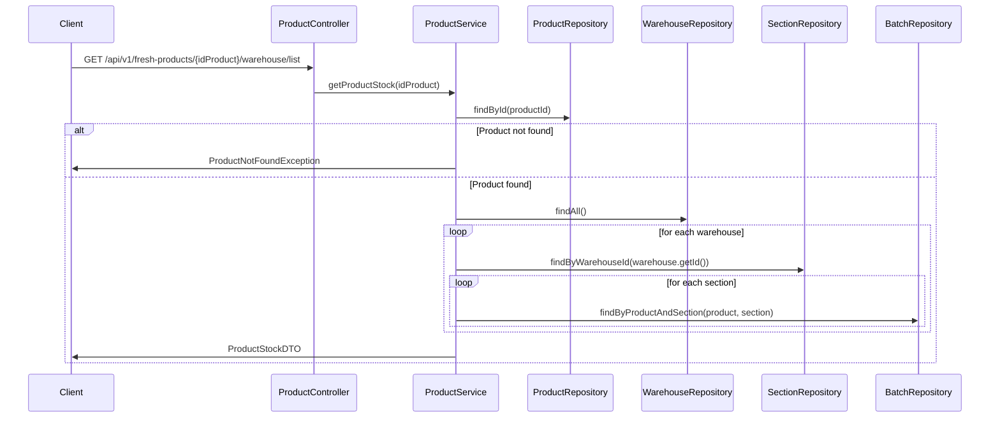
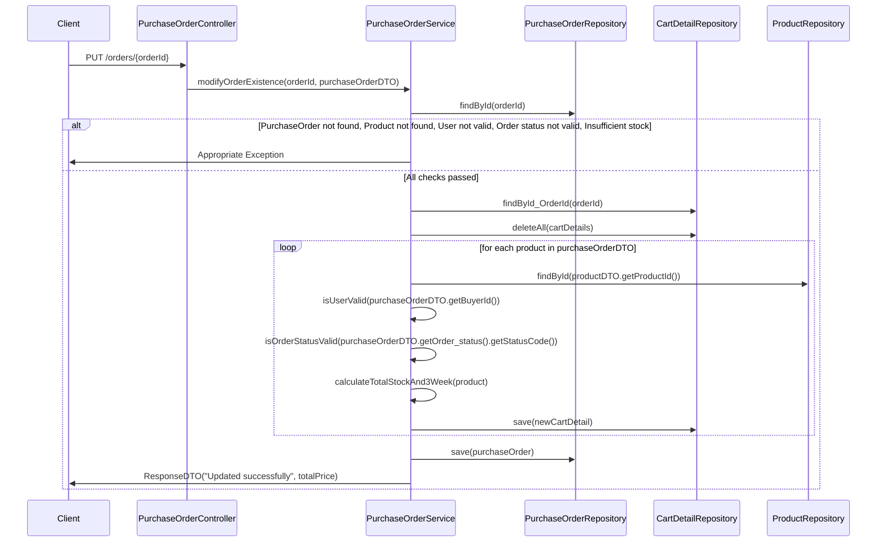
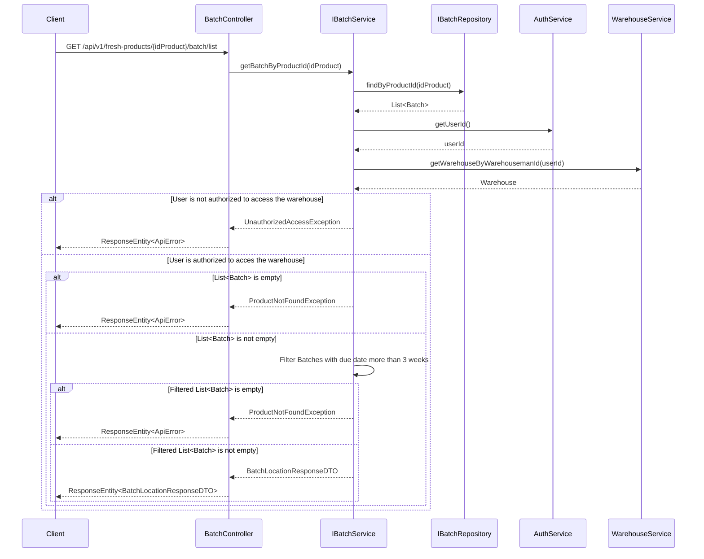
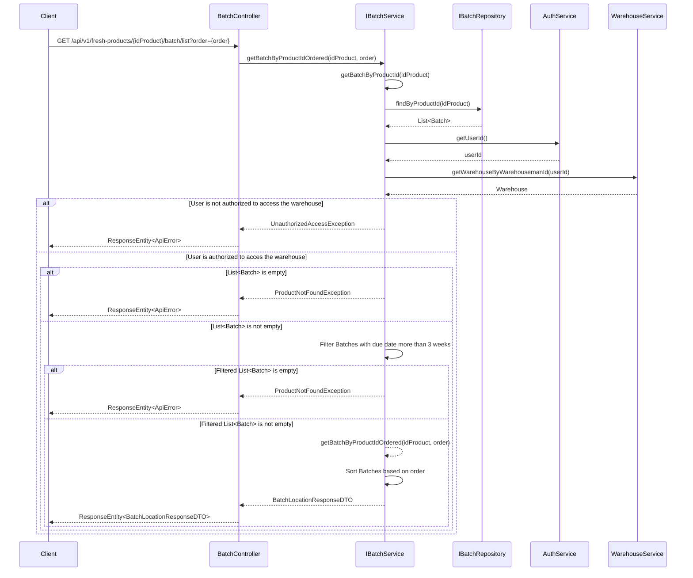
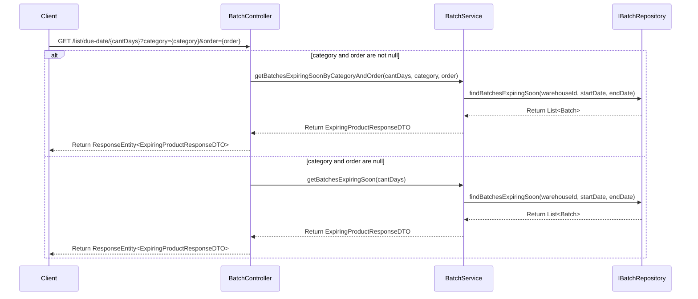

# Bootcamp Project - Fresh Products Management

## Objective

This project implements a REST API to manage fresh products within MercadoLibre's fulfillment warehouses. Below are the main functionalities of the system based on the defined user stories.

## User Stories

### 1. Enter batch in fulfillment warehouse

As a warehouseman, I want to enter a batch of products to register their existence in the stock.

#### Details
- Users can register a batch of products specifying details such as batch number, manufacturing date, expiration date, and current temperatures.
- The API provides endpoints to create a new batch, and update an existing batch.
### 2. Add product to shopping cart

As a buyer on MercadoLibre, I want to add products to the shopping cart to purchase them if desired.

#### Details
- Buyers can add products to the cart by specifying the product ID and desired quantity.
- The API offers endpoints to list available products and add products to the cart.

### 3. Check product location in warehouse

As a warehouseman, I want to check the location of a product in stock to know its sector and available batches.

#### Details
- Users can query the location details of a product by its product ID, including information on the sector and available batches.
- The API provides an endpoint to list batches of a specific product.

### 4. Check product stock in all warehouses

As a warehouseman, I want to check the stock of a product in all warehouses to know the available quantity.

#### Details
- Users can retrieve the total stock quantity of a product across all warehouses.
- The API offers an endpoint to query stock by product.

### 5. Check batch expiration date

As a warehouseman, I want to check products nearing expiration in a specific warehouse.

#### Details
- Users can retrieve batches nearing expiration within a specific number of days, sorted by expiration date.
- The API provides an endpoint to list batches by expiration date.

## Technologies Used

- Java
- Spring Framework (Spring Boot, Spring MVC, Spring Data JPA)
- Relational database: MySQL
- Swagger/OpenAPI for API documentation


Detailed API documentation is available in Swagger UI after starting the application (`https://fresh-market-prod.melioffice.com/swagger-ui/index.html`).


## ERD:


## Sequence Diagrams

### Authentication:

#### Objective

- Allow users to authenticate and register in the system.

#### Conditions

- The user must provide valid credentials for authentication.
- The user must provide valid information for registration.

#### Validations

- The system must validate the credentials during authentication.
- The system must validate the information during registration.

#### Endpoints

- `POST /api/v1/fresh-products/auth`: Authenticate a user. Returns a token if the authentication is successful.
- `POST /api/v1/fresh-products/auth/register`: Register a new user in the system. Returns a confirmation message if the registration is successful.

#### Additional Points

- The requirement emphasizes the need for secure authentication and registration processes.
- It mentions the use of tokens for authenticated sessions.






## Requirement 1
#### Objective

- Allow a Representative of a fulfillment warehouse to register a batch of products into the warehouse to record the existence of stock.

#### Conditions

- The product must be registered in the system.
- The seller of the product must be registered.
- The warehouse must be valid.
- The representative must belong to the specified warehouse.
- The sector must be valid and appropriate for the product type.
- The sector must have available space.

#### Validations

- The representative must authenticate to access the endpoints.
- The batch should be registered in the correct sector.
- The system should correctly record the warehouse sector.

#### Endpoints

- `POST /api/v1/fresh-products/inboundorder`: Create a new batch with the stock of products it contains. Return the new batch with status code "201 CREATED".
- `PUT /api/v1/fresh-products/inboundorder`: If the batch already exists and needs to be updated, return the updated stock with status code "201 CREATED".

#### Additional Points

- This requirement focuses on the process of registering new batches of products into a fulfillment warehouse.
- It highlights the importance of accurate sector assignment and stock recording.
- It includes the ability to update existing batches if necessary.

#### User history 1.1


#### User history 1.2


## Requeriment 2

#### Objective

- Allow a registered buyer to add products to a shopping cart in a marketplace, with the option to purchase them later.

#### Conditions

- The product must be registered in the system.
- The seller of the product must be registered.
- The product must have available stock.
- The product's expiration date must be more than 3 weeks away.

#### Validations

- The buyer must authenticate to access cart features.
- The existence of the product must be verified before adding it.
- The quantity added to the cart must be validated against the available stock.

#### Endpoints

- `GET /api/v1/fresh-products/list`: Get a complete product list or filter by category (FS, RF, FF).
- `POST /api/v1/fresh-products/orders`: Create a new order with the products in the cart.
- `GET /api/v1/fresh-products/orders/{idOrder}`: View the products in a specific order.
- `PUT /api/v1/fresh-products/orders/{idOrder}`: Modify an existing order (only if it's a cart type).

#### Additional Points

- The requirement includes HTTP error codes (404 Not Found, 201 Created) to indicate the outcome of operations.
- It mentions the need to notify the user if there is insufficient stock of a product.

#### User history 2.1



#### User history 2.2


#### User history 2.3


#### User history 2.4


#### User history 2.5



## Requeriment 3
#### Objective

- Allow a Representative to check the location of a product within a warehouse, including the sector and the specific batches where it's stored.

#### Conditions

- The product must be registered in the system.
- The seller of the product must be registered.
- The warehouse must be valid.
- The representative must belong to the specified warehouse.
- The sector must be valid and appropriate for the product type.
- The sector must contain the specified batch.
- The batch must contain the product.

#### Validations

- The representative must authenticate to access the endpoints.
- The product should not appear in an incorrect sector.
- The product should be listed in multiple batches.
- The product should not be expired or close to expiring (minimum 3 weeks remaining).

#### Endpoints

- `GET /api/v1/fresh-products/{idProduct}/batch/list`: View a list of all batches containing the product. Returns 404 Not Found if the list doesn't exist.
- `GET /api/v1/fresh-products/{idProduct}/batch/list?order={L, C, F}`: View a list of all batches containing the product, ordered by:
    - L = batch number
    - C = current quantity
    - F = expiration date

#### Additional Points

- The requirement emphasizes filtering and sorting options for the representative.
- It highlights the importance of accurate product location and batch information.
- It mentions the need to exclude expired or soon-to-expire products from the results.

#### User history 3.1 


#### User history 3.2


## Requeriment 4
#### Objective

- Allow a Representative to check the total stock quantity of a product across all warehouses.

#### Conditions

- The product must be registered in the system.
- The seller of the product must be registered.
- The warehouses must be valid.

#### Validations

- The representative must authenticate to access the endpoint.

#### Endpoints

- `GET /api/v1/fresh-products/{idProduct}/warehouse/list`: Get the total stock quantity of a product per warehouse. If the product doesn't exist in any warehouse, return a "404 Not Found" error.

#### Additional Points

- This requirement focuses on providing a high-level overview of product stock across all warehouses.
- It doesn't delve into details like batch numbers or expiration dates, focusing solely on total quantity per warehouse.
- It emphasizes the need for authentication to access this information.

#### User history 4


## Requeriment 5
#### Objective

- Allow a Representative to check products nearing their expiration date in a specific warehouse, so they can take appropriate commercial actions.

#### Conditions

- The product must be registered in the system.
- The seller of the product must be registered.
- The warehouse must be valid.
- The representative must belong to the specified warehouse.

#### Validations

- The representative must authenticate to access the endpoints.
- The product should not appear in an incorrect sector.
- The product should appear in different batches.
- The expiration date must be within the specified range.

#### Endpoints

- `GET /api/v1/fresh-products/batch/list/due-date/{cantDays}`: Get all batches expiring between today and the specified number of days later, ordered by expiration date.
- `GET /api/v1/fresh-products/batch/list/due-date/{cantDays}?category={FS, RF, FF}&order={date_asc, date_desc}`: Get all batches expiring between today and the specified number of days later, filtered by product category and ordered by expiration date (ascending or descending).

#### Additional Points

- This requirement focuses on helping representatives proactively manage products nearing expiration.
- It allows filtering by various criteria to pinpoint specific products of interest.
- It emphasizes the importance of accurate expiration date information.

#### User history 5


# Spring Boot App model for Java 17

We provide a basic model for JDK 17 / Spring based web applications.

Please address any questions and comments to [Fury Issue Tracker](https://github.com/mercadolibre/fury/issues).

## Usage

### SCOPE

The suffix of each Fury **SCOPE** is used to know which properties file to use, it is identified from the last '-' of the name of the scope.

If you want to run the application from your development IDE, you need to configure the environment variable **SCOPE=local** in the app luncher.

The properties of **application.yml** are always loaded and at the same time they are complemented with **application-<SCOPE_SUFFIX>.yml** properties. If a property is in both files, the one that is configured in **application-<SCOPE_SUFFIX>.yml** has preference over the property of **application.yml**.

For example, for the **SCOPE** 'items-loader-test' the **SCOPE_SUFFIX** would be 'test' and the loaded property files will be **application.yml** and **application-test.yml**

### Web Server

Each Spring Boot web application includes an embedded web server. For servlet stack applications, Its supports three web Servers:
* Tomcat (maven dependency: `spring-boot-starter-tomcat`)
* Jetty (maven dependency: `spring-boot-starter-jetty`)
* Undertow (maven dependency: `spring-boot-starter-undertow`)

This project is configured with Jetty, but to exchange WebServer, it is enough to configure the dependencies mentioned above in the pom.xml file.

### Main

The main class for this app is Application, where Spring context is initialized and SCOPE_SUFFIX is generated.

### Error Handling

We also provide basic handling for exceptions in ControllerExceptionHandler class.

## API Documentation

This project uses OpenAPI to automate the generation of machine and human readable specifications for JSON APIs written using Spring. OpenAPI works by examining an application, once, at runtime to infer API semantics based on spring configurations, class structure and various compile time java Annotations.

You can change this configuration in SpringDocConfig class.

### Fury Specs Hub

To simplify the management and maintainability of your API specs, we present [Fury Specs Hub](https://furydocs.io/specs-hub/latest/guide/#/). Fury Specs Hub is a new service from Fury that aims to be a one-stop solution for API definition. With Specs Hub, you will be able to:
- Define your APIs using OpenAPI or AsyncAPI.
- Automate the configuration and generation of your API specs with the help of new commands from the Fury CLI.
- Have all your specs in one place for visualization and management.
- Share them with other teams.
- Find available APIs based on the information you need.
- Usage documentation [Fury Specs Hub - Getting started](https://furydocs.io/specs-hub/latest/guide/#/tutorial/).

#### Usage guide fast reference

1. [Installing the Specs Hub plugin for Fury CLI.](https://furydocs.io/specs-hub/latest/guide/#/tutorial/install-specs-hub-furycli)
2. [Installing the OpenAPI plugin and initializing a basic configuration.](https://furydocs.io/specs-hub/latest/guide/#/tutorial/install-open-api)
3. [Generating your first API specification.](https://furydocs.io/specs-hub/latest/guide/#/tutorial/generate-open-api-spec)
4. [Validating your API specification.](https://furydocs.io/specs-hub/latest/guide/#/tutorial/validate-specs)
5. [Uploading your first specification.](https://furydocs.io/specs-hub/latest/guide/#/tutorial/upload-spec)
6. [Viewing your specification in Fury web.](https://furydocs.io/specs-hub/latest/guide/#/tutorial/view-spec)
7. [Managing your specification in Fury web.](https://furydocs.io/specs-hub/latest/guide/#/tutorial/manage-spec)

## [Release Process](https://release-process.furycloud.io/#/)

### Usage

1. Specify the correct tag for your app in your `Dockerfile` and `Dockerfile.runtime`, according to the desired Java runtime version.

```
# Dockerfile
FROM hub.furycloud.io/mercadolibre/java:17-mini
```

You can find all available tags for your `Dockerfile` [here](https://github.com/mercadolibre/fury_java-mini#supported-tags)

```
# Dockerfile.runtime
FROM hub.furycloud.io/mercadolibre/java:17-runtime-mini
```

You can find all available tags for your `Dockerfile.runtime` [here](https://github.com/mercadolibre/fury_java-mini-runtime#supported-tags)

2. Start coding!

##

### Questions

[Release Process Issue Tracker](https://github.com/mercadolibre/fury_release-process/issues)

## Contributors 👥

- [@Jhonatan Sánchez](https://github.com/jhonatansanchezp-meli)
- [@Joan Andrés Gómez](https://github.com/jgomezreyes)
- [@Fabian Trujillo](https://github.com/fabian001254)
- [@Edwin Steven Guayacan](https://github.com/EdwinGuayacan)
- [@Mario Iván Lozano](https://github.com/ivanlozanoq)
- [@Geraldine Gómez](https://github.com/ggomezr1403)
- [@Nilson Vargas](https://github.com/nvargasparra)
