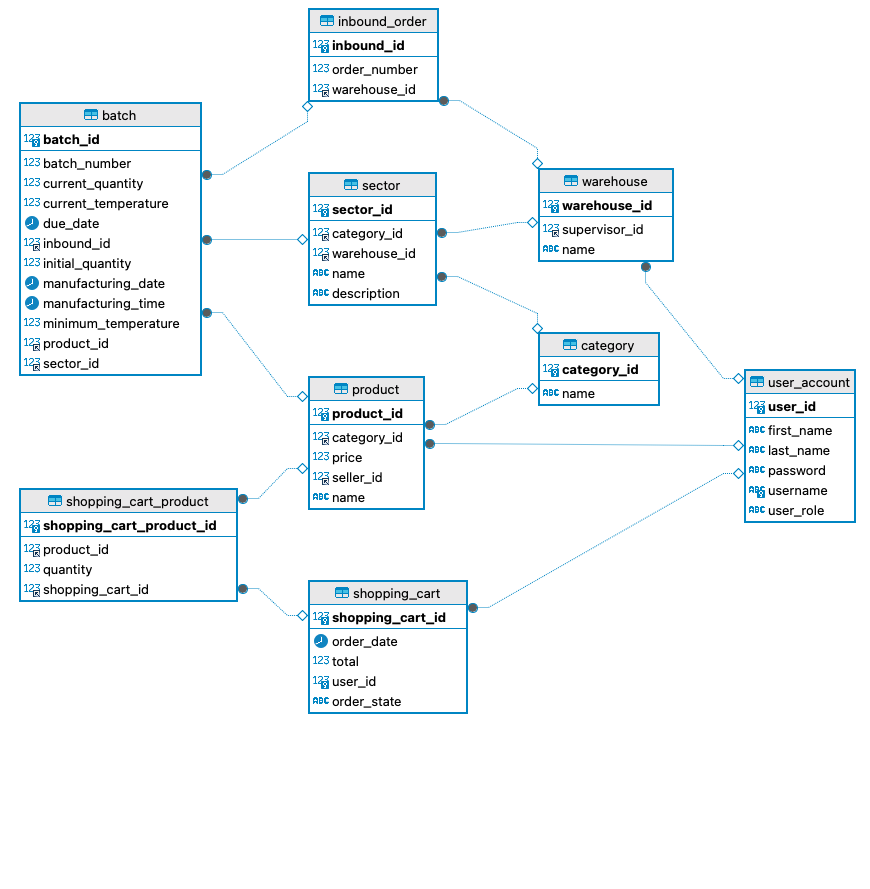

# Sprint III - Solución individual

## Sobre el proyecto

El desarrollo se realizó en springboot, se integró con una base de datos relacional el mysql.
Es importante que al momento de correrlo localmente se haya creado la base de datos. Las pruebas
se están realizando con h2 a partir del script que hace los inserts en la base de datos.

A continuación, también muestran que variables de entorno deberían tener configuradas para la base de datos:
```
{DB_LOCAL_USER}: Nombre del usuario del servidor de mysql
{DB_LOCAL_PASS}: Contraseña del servidor local de mysql
{DB_LOCAL_PORT}: El puerto con el que se conecta a la base de datos
{DB_LOCAL_NAME}: Nombre de la base de datos creada para el proyecto
```

## Diagrama de base de datos 
En el siguiente diagrama se puede ver representada las entidades y sus relaciones que fueron implementadas en el proyecto. 


## Historia de Usuario 6

Es importante precisar sobre como se llenan los campos en el json response cuando tiene el siguiente formato:
```
{
    "operation": "Integer",
    "message": "String",
    "code": Integer,
}
```
Se asignan los valores de la siguiente forma:
```
    "operation": El numero de operaciones de updates/creates que se realizaron,
    "message": La operación que llevo a cabo,
    "code": El mismo codigo de respuesta que se devuelve en status,
```

Sobre los enpoints propuestos son dos que hacen los siguiente:
1. Trae todos los productos que tiene un vendedor
2. Actualizar varios productos en un solo request


