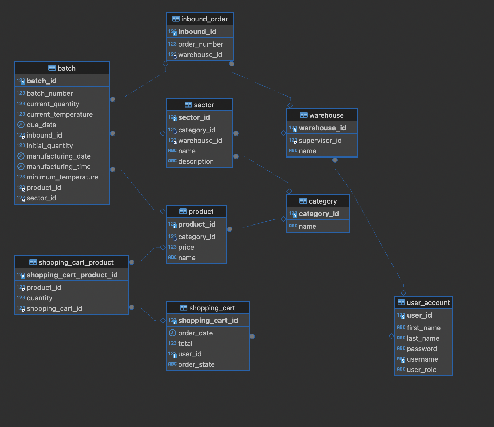

# pf-be-hisp-w26-t10-guzmanq

# FrescosMeli - Individual Sprint lll
MercadoLibre es la empresa líder en comercio electrónico de LATAM con operaciones en  18 países. MELI (como se la conoce por sus siglas en la bolsa de NY) desea ampliar su negocio para incluir en su listing (oferta), productos FRESCOS. Hoy MELI ya vende productos alimenticios pero quiere incursionar en poder vender productos que necesitan refrigeración; a estos los denomina productos frescos. implica nuevos retos en la forma de almacenar,  transportar y comercializar los productos, ya que se realiza de una forma totalmente diferente. El modelo de negocios implementado actualmente en relación a cómo tratamos nuestros productos (almacenamiento, transporte y comercialización) es incompatible para los productos frescos de la industria alimentaria, motivo por el cual tenemos el desafío de cumplir con estos nuevos requisitos para así poder cubrir las necesidades de este nuevo mercado.
Todos los productos, para que puedan ser almacenables, transportables y comercializables deben de poseer información común como la fecha de caducidad y número de lote, y cada tipo de producto además posee alguna información específica.

# Requerimiento 6
En este proyecto se implementa una nueva feature descrita en el requerimento 6 https://docs.google.com/document/d/1pf8iNRIpXX4UBHg9jlvqm3JJ2ErwLokd/edit?usp=sharing&ouid=101683317922866668237&rtpof=true&sd=true

La historia de usuario permite que el representante del warehouse de fulfillment consulte las ventas del último mes. Esto incluye revisar el total recaudado, la cantidad de productos vendidos, el producto más vendido y la cantidad de órdenes ingresadas. Con esta información, el supervisor puede evaluar la rentabilidad del warehouse y determinar si las estrategias de gestión actuales son efectivas.
Se entrega collección de postman y el diagrama ER en la carpeta de resources al igual que la historia de usuario Requirement 6 en formato pdf

### Instalación
El proyecto esta preparado para su uso, la colección de endpoints se encuentra registrado en el archivo "" que corresponde a una colección de la herramienta postman.
Dirección de autenticacion:
##### /auth/login
Estructura de json:
{
"username":"",
"password":""
}
### Accesos
Para usar esta herramienta, se requiere tener presente, que cada enpoint cuenta con seguridad de acceso al mismo, por lo tanto, cada usuario debe de autenticarse como se menciona en el punto anterior.
Para esto, la autenticación nos genera un token de acceso para ser enviado como header en la url a la cual queremos acceder.

## Requisitos Clave

### Gestión de Información de Productos:
- Todos los productos deben tener información común: fecha de caducidad y número de lote.
- Cada tipo de producto puede tener información adicional específica.

### Envío y Manejo:
- Gestionar envíos que contengan productos frescos, refrigerados o congelados.
- Asegurar que los productos lleguen en óptimas condiciones al cliente final.

### Experiencia del Usuario (Buyer):
- Los usuarios deben poder listar productos en el Marketplace.
- Los compradores pueden ver detalles de los productos, seleccionar cantidades, añadir al carrito y proceder al checkout.
- Asegurar el manejo y agrupación adecuados de los productos para mantener su condición durante la entrega.

### Interacción con Vendedores (Sellers):
- Los vendedores envían mercancías al almacén de MELI para su correcto almacenamiento.
- El almacén debe tener diferentes áreas refrigeradas para cumplir con los requisitos de los productos.

### Gestión de Almacenes:
- Distribuir productos en múltiples almacenes ubicados geográficamente.
- Asegurar que las ventas se cumplan desde un solo almacén cuando sea posible.

### Cumplimiento de Pedidos:
- El proceso de picking y packing involucra recoger productos y prepararlos para el despacho.
- Requisitos especiales para productos frescos, posiblemente utilizando bolsas o cajones refrigerados.

## Requisitos Funcionales

### Gestión de Stock:
- Registrar lotes de productos en el stock del almacén.
- Almacenar productos en el sector correcto para mantener su condición.
- Rastrear productos cercanos a su vencimiento para tomar acciones apropiadas (devolución al vendedor, eliminación o liquidación).

### Seguimiento de Inventario:
- Consultar niveles de stock y listar productos por almacén.
- Identificar la ubicación del almacén para productos específicos.

### Procesamiento de Pedidos:
- Registrar órdenes de compra para guiar a los colaboradores en la preparación de los pedidos para el despacho.

## Desafíos

- **Integración de Tecnologías Avanzadas**:
    - Implementar tecnologías como Fury para el desarrollo eficiente y robusto de la aplicación.

- **Adopción de Buenas Prácticas**:
    - Incorporar prácticas de testing, arquitectura sólida y patrones de diseño en el proceso de desarrollo para garantizar un código de alta calidad y mantenibilidad.

- **Adaptación de Almacenamiento y Transporte**:
    - Modificar y optimizar los métodos actuales de almacenamiento y transporte para adaptarse a las necesidades específicas de productos frescos, refrigerados y congelados.

- **Gestión de Diversidad de Productos**:
    - Establecer procesos y protocolos que aseguren un manejo adecuado de diferentes tipos de productos a lo largo de la cadena de suministro, manteniendo su integridad y frescura.

- **Mantenimiento de Calidad del Producto**:
    - Implementar medidas y controles rigurosos para asegurar que la calidad de los productos se mantenga desde el almacenamiento hasta la entrega final, cumpliendo con los estándares de calidad y seguridad.

## Objetivo
Objetivo personal: Es implementar tecnologías avanzadas, como Fury, para el desarrollo del aplicativo, garantizando un rendimiento óptimo y escalabilidad. Además, adoptaremos las mejores prácticas de desarrollo, incluyendo testing exhaustivo, una arquitectura bien definida y la aplicación de patrones de diseño reconocidos, con el fin de asegurar la calidad, mantenibilidad y robustez del código.

Objetivo FrescosMeli: Nuestro objetivo es seguir democratizando el comercio electrónico y transformando LATAM mediante la creación de los artefactos necesarios para incluir productos frescos en nuestra oferta. Esto implica asegurar un almacenamiento, transporte y entrega eficientes, mientras se mantiene la calidad de los productos.

# Diagrama UML
## Modelo ER



# Spring Boot App model for Java 17

We provide a basic model for JDK 17 / Spring based web applications.

Please address any questions and comments to [Fury Issue Tracker](https://github.com/mercadolibre/fury/issues).

## Usage

### SCOPE

The suffix of each Fury **SCOPE** is used to know which properties file to use, it is identified from the last '-' of the name of the scope.

If you want to run the application from your development IDE, you need to configure the environment variable **SCOPE=local** in the app luncher.

The properties of **application.yml** are always loaded and at the same time they are complemented with **application-<SCOPE_SUFFIX>.yml** properties. If a property is in both files, the one that is configured in **application-<SCOPE_SUFFIX>.yml** has preference over the property of **application.yml**.

For example, for the **SCOPE** 'items-loader-test' the **SCOPE_SUFFIX** would be 'test' and the loaded property files will be **application.yml** and **application-test.yml**

### Web Server

Each Spring Boot web application includes an embedded web server. For servlet stack applications, Its supports three web Servers:
* Tomcat (maven dependency: `spring-boot-starter-tomcat`)
* Jetty (maven dependency: `spring-boot-starter-jetty`)
* Undertow (maven dependency: `spring-boot-starter-undertow`)

This project is configured with Jetty, but to exchange WebServer, it is enough to configure the dependencies mentioned above in the pom.xml file.

### Main

The main class for this app is Application, where Spring context is initialized and SCOPE_SUFFIX is generated.

### Error Handling

We also provide basic handling for exceptions in ControllerExceptionHandler class.

## API Documentation

This project uses OpenAPI to automate the generation of machine and human readable specifications for JSON APIs written using Spring. OpenAPI works by examining an application, once, at runtime to infer API semantics based on spring configurations, class structure and various compile time java Annotations.

You can change this configuration in SpringDocConfig class.

### Fury Specs Hub

To simplify the management and maintainability of your API specs, we present [Fury Specs Hub](https://furydocs.io/specs-hub/latest/guide/#/). Fury Specs Hub is a new service from Fury that aims to be a one-stop solution for API definition. With Specs Hub, you will be able to:
- Define your APIs using OpenAPI or AsyncAPI.
- Automate the configuration and generation of your API specs with the help of new commands from the Fury CLI.
- Have all your specs in one place for visualization and management.
- Share them with other teams.
- Find available APIs based on the information you need.
- Usage documentation [Fury Specs Hub - Getting started](https://furydocs.io/specs-hub/latest/guide/#/tutorial/).

#### Usage guide fast reference

1. [Installing the Specs Hub plugin for Fury CLI.](https://furydocs.io/specs-hub/latest/guide/#/tutorial/install-specs-hub-furycli)
2. [Installing the OpenAPI plugin and initializing a basic configuration.](https://furydocs.io/specs-hub/latest/guide/#/tutorial/install-open-api)
3. [Generating your first API specification.](https://furydocs.io/specs-hub/latest/guide/#/tutorial/generate-open-api-spec)
4. [Validating your API specification.](https://furydocs.io/specs-hub/latest/guide/#/tutorial/validate-specs)
5. [Uploading your first specification.](https://furydocs.io/specs-hub/latest/guide/#/tutorial/upload-spec)
6. [Viewing your specification in Fury web.](https://furydocs.io/specs-hub/latest/guide/#/tutorial/view-spec)
7. [Managing your specification in Fury web.](https://furydocs.io/specs-hub/latest/guide/#/tutorial/manage-spec)

## [Release Process](https://release-process.furycloud.io/#/)

### Usage

1. Specify the correct tag for your app in your `Dockerfile` and `Dockerfile.runtime`, according to the desired Java runtime version.

```
# Dockerfile
FROM hub.furycloud.io/mercadolibre/java:17-mini
```

You can find all available tags for your `Dockerfile` [here](https://github.com/mercadolibre/fury_java-mini#supported-tags)

```
# Dockerfile.runtime
FROM hub.furycloud.io/mercadolibre/java:17-runtime-mini
```

You can find all available tags for your `Dockerfile.runtime` [here](https://github.com/mercadolibre/fury_java-mini-runtime#supported-tags)

2. Start coding!

### Questions

[Release Process Issue Tracker](https://github.com/mercadolibre/fury_release-process/issues)
