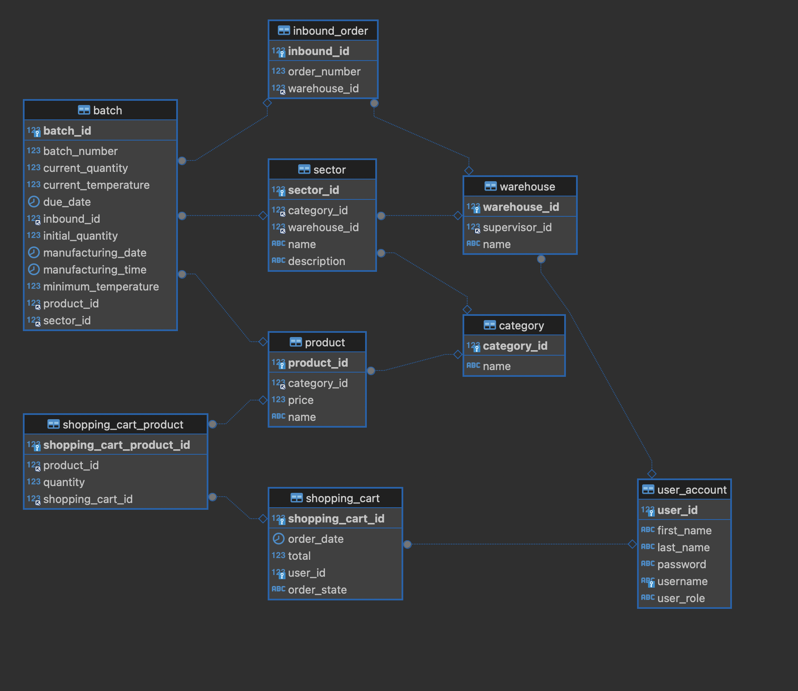

# pf-be-hisp-w26-t10-hoyos

# Proyecto final individual Nicolas Hoyos

Aplicacion hecha en Java 17, la implementacion utiliza tecnologias tales como SpringBoot, MySQL, Hibernate, JWT.

## W26 Java Meli Bootcamp

## Diagrama DER

### La colección de postman esta en esta misma ruta

Se realizó la implentación de cuatro endpoint como parte del proyecto final

### Despliegue en la plataforma [Fury](https://web.furycloud.io/pf-be-hisp-w26-t10-hoyos/summary).

### A mas ruta de fury para acceder a los endpoints [Chequear endpoints](nhoyoste10-prod.pf-be-hisp-w26-t10-hoyos.melifrontends.com)